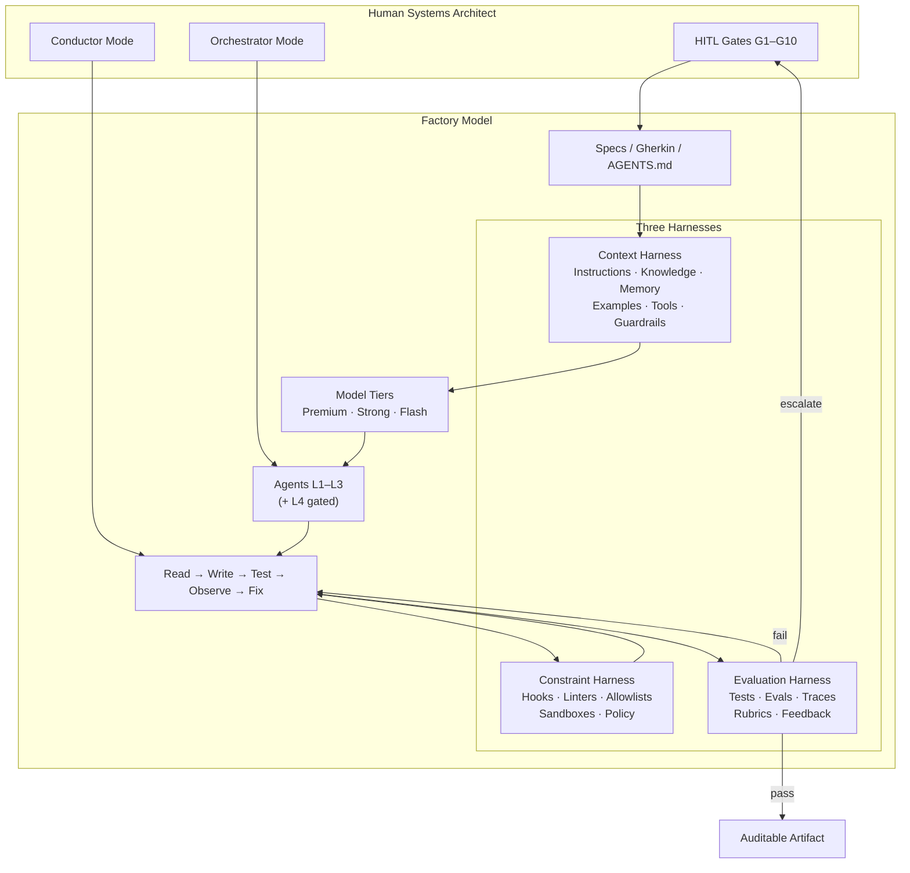

# HARNESS_SPEC.md
## Agentic R&D Workspace — Architectural Constitution (G1)
**Version:** 1.0.0 (G1 gate approved; Step E/F still open)  
**Domain:** G1 — Agent Foundations & Architecture  
**Status:** APPROVED (`OPTION_2_STANDARD` · `RESUME_TOKEN: G1_HARNESS_APPROVED_v1` granted)  
**Primary Anchors:** WP-F1 *Introduction to Agents* (Nov 2025) · WP-S1 *The New SDLC With Vibe Coding* (May 2026) · `AGENTIC R&D & IMPLEMENTATION BLUE.md`  
**Precedence:** Course-2 (WP-S*) logic supersedes Course-1 (WP-F*) on overlap.  
**Harness Runtime:** Hermes CLI + Antigravity unified harness (`antigravity agent invoke --harness hermes` / Google AI Studio Build mode).  
**Skills Spec:** agentskills.io progressive disclosure (L1 metadata always · L2 body on trigger · L3 references/assets/scripts on demand).  
**Model Routing:** Dynamic only — Premium Frontier · Strong Coding · Fast Flash. No frozen model pins.

> **Scope boundary:** This document is a *declarative constitution*. It produces no application runtime code. Downstream domains G2–G10 inherit every element herein unless a later HITL gate explicitly amends it.

---

## 0. Purpose & Non-Goals

### 0.1 Purpose
Establish a formally-specified **three-harness Factory Model** so every autonomous `Read → Write → Test → Observe → Fix` loop is *correct-by-construction*, auditable at strategic gates, and slottable by G2–G10 without re-deriving foundations.

### 0.2 Non-Goals
- No executable agent logic, framework glue, or production Codegen beyond declarative specs.
- No frozen model versions or vendor lock-in to a single LM.
- No ad-hoc vibe-coding paths into production branches (prototype dunes are explicit and isolated).

---

## 1. AGENTIC TAXONOMY EVOLUTION
### WP-F1 L0–L4 × WP-S1 Factory Model Mapping

WP-F1 defines the operational loop as **Get Mission → Scan Scene → Think → Act → Observe/Iterate** (collapses to the ReAct *Think–Act–Observe* cycle) and classifies capability on five levels. WP-S1 reframes the developer as **factory manager**: the primary deliverable is the *system that produces software* (specs, agents, tests, feedback loops, guardrails), not hand-written widgets. The three harnesses are the factory machinery wrapped around the model:

```
Agent  =  Model  +  Harness
Harness = Context Harness  ∪  Constraint Harness  ∪  Evaluation Harness
```

| WP-F1 Level | Name (WP-F1) | Core Capability | Factory Role (WP-S1) | Minimum Harnesses Required | Developer Mode | Default Topology |
|---|---|---|---|---|---|---|
| **L0** | Core Reasoning System | LM in isolation; no tools/memory/live env | *Not an agent* — raw engine on the floor | None (context only via prompt) | N/A — manuscript generation | Single-shot completion |
| **L1** | Connected Problem-Solver | Tools as "Hands"; one-shot external grounding | Single-station cell | Context (Tools+Knowledge) + Constraint (tool allowlist + sandbox) + Evaluation (output check) | Conductor | Single agent + tools |
| **L2** | Strategic Problem-Solver | Multi-step planning + **context engineering** | Multi-station cell with staged WIP | Full Context (all 6 types, static/dynamic split) + Constraint (architectural boundaries) + Evaluation (trajectory + output) | Conductor → light Orchestrator | Single agent, multi-tool sequential loop |
| **L3** | Collaborative Multi-Agent System | Agents-as-tools; division of labor; A2A Agent Cards | Multi-line factory floor | Per-agent Context+Constraint; shared Evaluation; policy server on edges | Orchestrator | Hierarchical coordinator + specialists (or sequential assembly line) |
| **L4** | Self-Evolving System | Meta-reasoning; creates tools/agents on gap detection | Self-retooling factory (requires G7 bounds) | All three harnesses **plus** meta-Evaluation on capability expansion; HITL on creation events | Orchestrator + G7 gates | Dynamic topology with AgentCreator gated by Evaluation + HITL |

### 1.1 Level Selection Rules (this workspace)

| Decision | Rule |
|---|---|
| Default operating level | **L2** for single-domain tasks; **L3** when G4 multi-agent is approved |
| L4 entry | Forbidden until `RESUME_TOKEN: G7_*` and G1 Option remains Standard or Creative with explicit enablement |
| L0 usage | Allowed only for pure analysis / ADR drafting with no side effects |
| Prototype dune | Vibe-coding (low harness) permitted on throwaway branches; never auto-merges to protected trunks |

### 1.2 Think–Act–Observe Loop Contract

Every agent cycle MUST surface the following structured trajectory fields (Evaluation Harness consumes them):

1. **Mission** — goal text + acceptance criteria reference (Gherkin tag or spec path)  
2. **Scene** — context package IDs loaded (static snapshot + dynamic fetches)  
3. **Thought** — plan step / selected tool / refusal rationale  
4. **Action** — tool name, args hash, sandbox id  
5. **Observation** — tool result summary, exit code, truncated payload ref  
6. **Verdict** — `continue` · `success` · `fail` · `escalate_HITL`  

Orchestration owns loop control. Models never self-authorize irreversible actions without Constraint Harness hooks.

---

## 2. CONTEXT HARNESS DESIGN
### Six Context Types — Static vs Dynamic Placement + Token Economy

WP-S1 (pp. 15–18) enumerates six primary context types and the static/dynamic split. This section is the binding design for the workspace.

### 2.1 Context Type Catalog

| # | Type | Definition | Default Placement | Authoritative Artifacts | Token Cost Profile | Progressive Disclosure |
|---|---|---|---|---|---|---|
| 1 | **Instructions** | Role, goals, operational boundaries, persona | **Static** (small, high-signal) | Root `AGENTS.md`; module `GEMINI.md` / `CLAUDE.md`; system prompt fragments | Always-on; target ≤ 2–4k tok | L1 constitution always; specialty instructions via skills L2 |
| 2 | **Knowledge** | Retrieved docs, ADRs, architecture diagrams, domain data | **Dynamic** (RAG / path-scoped reads) | `specs/`, `docs/`, whitepaper extracts under `specs/references/` | Pay-per-retrieve; chunk + cite | Index metadata static; bodies on demand |
| 3 | **Memory** | Short-term session state + long-term persistent facts | Hybrid: session window **dynamic**; standing profile **static-small** | Session store; Honcho/profile memory; `SESSION_STATE_SPEC` (G3) | Windowed; compact on threshold | Never dump full history; summarize + pin |
| 4 | **Examples** | Few-shot behaviors, golden trajectories, reference patches | **Dynamic** (task-matched) | `examples/`, eval golden sets, skill-embedded samples | Loaded only on skill match | Prefer 1–3 tight examples over large dumps |
| 5 | **Tools** | API/MCP/function schemas + invocation prose | **Dynamic** progressive disclosure | MCP registry (G2 `TOOL_REGISTRY.md`); skill tool wrappers | Schemas only for eligible tools | "RAG-for-tools": intent-match → load schema |
| 6 | **Guardrails** | Hard constraints, safety, formatting, policy | **Static** core + **dynamic** specialized | Constraint Harness catalog (§3); hooks; policy snippets | Core rules always-on (≤ 1–2k tok) | Domain guardrails ride with skill L2 |

### 2.2 Static Budget Envelope (per model call)

| Bucket | Target Share of Context Window | Notes |
|---|---|---|
| Instructions (constitution) | 5–10% | Root AGENTS.md distilled; not full blueprint |
| Guardrails (core) | 3–5% | Inviolable rules only |
| Memory (pinned profile) | 2–5% | Preferences, env facts — not task logs |
| Working mission + scene | 15–25% | Current goal, acceptance, open file map |
| Dynamic (tools/skills/knowledge/examples/obs) | 40–60% | Headroom for tool results |
| Reserve / output | 10–15% | Completion + structured verdict |

**Hard rule:** If static payload exceeds 20% of the active context window, split into skill-backed progressive disclosure before adding more always-on text.

### 2.3 Context Assembly Pipeline

```
IDLE
  → load STATIC pack (Instructions ∩ core Guardrails ∩ pinned Memory)
  → match Skills (L1 metadata scan)
  → on trigger: load Skill L2 (+ L3 refs as needed)
  → intent-match Tools → inject schemas
  → retrieve Knowledge chunks with citations
  → attach windowed Memory / prior Observations
  → invoke Model
  → capture Action/Observation
  → compact if token, turn, or semantic threshold hit
  → loop or terminate with Verdict
```

### 2.4 Context Harness Ownership

| Concern | Owner Artifact | Downstream Domain |
|---|---|---|
| Constitution text | `AGENTS.md`, this spec | G1 |
| Skills tree + progressive disclosure | `skills/**` | G3 |
| Session/memory backends | `SESSION_STATE_SPEC.md` | G3 |
| Tool schema disclosure | `TOOL_REGISTRY.md` | G2 |
| Token budgets | `token_budget.yaml` | G3 |
| Trajectory context fields | OTEL + eval rubrics | G5 |

---

## 3. CONSTRAINT HARNESS DESIGN
### Standards, Boundaries, Enforcement

Constraints are **factory hard tooling**: deterministic where possible, LLM-audited only when semantics demand it. WP-S1: "Most agent failures, examined honestly, are configuration failures." Hooks exist for rules the agent must never forget.

### 3.1 Constraint Catalog

| ID | Category | Rule (normative) | Severity | Enforcement Mechanism | Failure Action |
|---|---|---|---|---|---|
| C-FS-01 | File structure | Declarative specs live under `specs/`; constitution at root (`HARNESS_SPEC.md`, `AGENTS.md`); no app code from G1 meta-prompts | blocker | Structural test + path allowlist hook | Reject write / HITL |
| C-FS-02 | File structure | Skills follow agentskills.io layout (`SKILL.md` + optional `references/`, `scripts/`, `assets/`) | blocker | Skill linter | Reject skill load |
| C-LIB-01 | Libraries | No undeclared runtime dependencies; lockfiles are source of truth | blocker | Package auditor (pip/npm) | Fail CI |
| C-LIB-02 | Libraries | Ban hallucinated / slopsquat packages (names not in registry or allowlist) | blocker | Install hook + registry check | Block install |
| C-ARCH-01 | Architecture | WSL2 substrate is mandatory for shell/Python in this workspace; host Windows Python forbidden for project work | blocker | Execution-routing skill + path guards | Re-route / fail |
| C-ARCH-02 | Architecture | `appendWindowsPath=false` and sandbox isolation are inviolable | blocker | Runtime config assert | Halt |
| C-ARCH-03 | Architecture | No raw secrets in specs, commits, logs, or prompts | blocker | Secret scanner pre-commit + redaction hooks | Block commit |
| C-ARCH-04 | Architecture | Side-effecting tools require Constraint pre-hooks; irreversible ops need HITL tool | blocker | Tool-gateway policy | Escalate |
| C-CODE-01 | Coding standards | Language formatters/linters are deterministic gates (ruff/eslint/prettier as applicable) | major | Formatter + lint CI | Fail PR |
| C-CODE-02 | Coding standards | Conventional commits; constitution changes require label `harness` | minor | Commit-msg lint | Reject commit |
| C-CODE-03 | Coding standards | Generated code on production paths must cite governing Gherkin/spec IDs in PR body | major | PR template check | Request changes |
| C-SEC-01 | Security | OWASP Top-10 posture; treat local network as untrusted by default | blocker | Static rules + G5/G8 audits | Halt domain |
| C-SEC-02 | Security | Progressive trust: least privilege toolscopes per agent role | blocker | Tool allowlists per role | Deny tool |
| C-SEC-03 | Security | No cross-profile Hermes writes without explicit `cross_profile=True` direction | major | Profile write guard | Refuse write |
| C-LOOP-01 | Autonomy bounds | Max N fix iterations without Evaluation improvement → escalate HITL | major | Orchestration counter | escalate_HITL |
| C-LOOP-02 | Autonomy bounds | L4 capability creation disabled until G7 resume token | blocker | Feature flag | Deny AgentCreator |
| C-MODEL-01 | Model routing | Dynamic tier selection only; tasks map to Premium/Strong/Flash matrix in `AGENTS.md` | major | Router policy | Reroute |
| C-HITL-01 | Gates | Strategic domain gates (G1–G10) are HARD_STOP until resume token | blocker | Workflow graph state machine | Halt downstream |

### 3.2 Enforcement Stack (layered)

```
Layer 0  Deterministic hooks (pre-tool, post-edit, pre-commit)     — never LLM
Layer 1  Structural tests & schema validators                       — never LLM
Layer 2  Linters / typecheckers / package auditors                  — never LLM
Layer 3  LLM-auditor (semantic architecture / policy gray zones)    — Strong Coding tier
Layer 4  Human gate (HITL)                                          — strategic only
```

**Principle:** Prefer moving a rule down the stack (more deterministic) over adding prompt text. Prompted constraints without hooks are *aspirational*, not enforced.

### 3.3 Coding / Structural Conventions (workspace baseline)

```
agentic-rd/
├── AGENTS.md                 # Global constitution (runtime contract)
├── HARNESS_SPEC.md           # Architectural deep-spec (this file)
├── specs/
│   ├── workflow_graph.yaml   # Factory topology + gates
│   ├── references/           # Immutable whitepaper corpus
│   └── **                    # Domain blueprints (G2+)
├── .gherkin/                 # BDD acceptance for harness & domains
├── skills/                   # agentskills.io progressive disclosure library
├── .hermes/                  # Profile-local Hermes affordances (if present)
└── ...
```

Module-level stubs (`GEMINI.md` / equivalent) inherit root `AGENTS.md` and may only *tighten* constraints, never relax blockers without G1 amendment.

---

## 4. EVALUATION HARNESS DESIGN
### Correctness, Loops, and Feedback into Autonomy

WP-S1: tests verify deterministic parts; **evals** verify non-deterministic trajectory, tool choice, and final quality. Without both, practice collapses to vibe coding regardless of prompt sophistication.

### 4.1 Correctness Definitions

| Class | What "correct" means | Checker | Gate |
|---|---|---|---|
| **Syntactic** | Parses/formats; schema-valid YAML/JSON/MD frontmatter | Deterministic linters/validators | PR / pre-commit |
| **Structural** | Paths, skill layout, workflow graph integrity, import graph | Structural test suite | CI required |
| **Functional** | Spec/Gherkin scenarios pass on artifacts or code | Automated test runner in sandbox | CI + agent loop observe |
| **Trajectory** | Tool sequence lawful; no skipped verification; policy respected | Trace rubric + optional LLM-as-Judge | G5 eval service |
| **Semantic / Quality** | Meets rubric (task success, hallucination, PII, tone) | LLM-as-Judge + golden sets | CI eval job + sampling |
| **Security / Trust** | Effective Trust pillars (sandbox, slopsquat, RBGC, OTEL, resolvers, roles, semantic safety) | G5 7-pillar suite | Release gate |

### 4.2 Autonomous Loop Integration

```
                    ┌──────────────────────────┐
                    │   Mission + Acceptance    │
                    └────────────┬─────────────┘
                                 ▼
              ┌──────────────────────────────────────┐
              │ Context Harness assembles scene      │
              └──────────────────┬───────────────────┘
                                 ▼
                         Think (Model)
                                 ▼
              ┌──────────────────────────────────────┐
              │ Constraint Harness pre-tool hooks    │
              └──────────────────┬───────────────────┘
                                 ▼
                              Act (Tool)
                                 ▼
                           Observe (result)
                                 ▼
              ┌──────────────────────────────────────┐
              │ Evaluation Harness:                  │
              │  - run tests / schema checks         │
              │  - score trajectory step             │
              │  - detect loops / regressions        │
              └──────────────────┬───────────────────┘
                     ┌───────────┼───────────┐
                     ▼           ▼           ▼
                  PASS        FAIL        ESCALATE
                 complete   fix-budget?   HITL tool
                              yes→Think    no→stop
```

### 4.3 Feedback Contracts

| Signal | Source | Consumer | SLA |
|---|---|---|---|
| Test fail stderr/exit | Sandbox runner | Orchestration → Model as Observation | Immediate in-loop |
| Lint/structural fail | CI / local hooks | Block merge; agent auto-fix if in coding loop | Immediate |
| Eval rubric < threshold | G5 judge | Flag run; open defect; optional prompt/tool patch proposal | Batch + critical path |
| Policy deny | Constraint gateway | Observation + alternate plan or HITL | Immediate |
| Drift / cost anomaly | Observability meters | Human dashboard; auto-throttle Flash←Premium promotions | Near-real-time |
| Domain HITL matrix | Workflow graph | Human decision; resume token | Hard stop |

### 4.4 Minimum Eval Suite (G1 substrate)

Even before G5 deep framework, G1 requires:

1. **Constitution integrity tests** — required files exist; YAML parses; markdown anchors resolvable.  
2. **Constraint catalog coverage** — every `C-*` ID referenced by at least one hook or structural check stub.  
3. **Workflow graph validation** — nodes/edges resolve; HITL gates have resume tokens; no orphan domains.  
4. **Taxonomy conformance** — declared agent level ∈ {L0…L4}; L4 gated.  
5. **No-secret scan** on constitution paths.  

Full LLM-as-Judge, OTEL trajectories, Red/Blue/Green rotation: owned by **G5**.

---

## 5. TRACEABILITY MATRIX
### Harness element → whitepaper → G2–G10 impact

| Harness Element | WP-F1 Anchor | WP-S1 Anchor | Impacts |
|---|---|---|---|
| L0–L4 taxonomy | §§ Taxonomy pp.14–18; Conclusion p.51 | Spectrum vibe→agentic eng. pp.12–15; ambient/workflow/autonomous framing | G4 topology choice; G7 L4 bounds; G9 research fleets |
| Think–Act–Observe / 5-step loop | §§ Process pp.10–13; Architecture p.19+ | Agent loop fig. p.10; harness creates automated loop p.30 | All domains' runtime loops; G5 trajectory schema |
| Model + Tools + Orchestration | Core architecture pp.19–26 | Agent = Model + Harness pp.26–28 | G2 tools; G4 orchestration; G10 runtime |
| Context 6-types + static/dynamic | Context curation pp.9–10, 24 | Context engineering pp.15–18 | **G3** primary; token budgets; skills |
| Instructions / AGENTS.md | System prompt as constitution p.23–24 | Instructions & rule files p.28; start guide p.43 | All agents; PR review norms |
| Skills progressive disclosure | (extended in F3) | pp.17–18; dynamic context p.42 | **G3** skills library |
| Tools / MCP | Tools pp.20–22; MCP note | Harness tools p.28; MCP/A2A adoption p.45 | **G2** registry; **G4** A2A |
| Guardrails / Hooks | HITL pattern p.26; constraints in instructions | Guardrails/hooks p.28, 30; security remediation p.41 | Constraint Harness; **G8** policy; **G10** CI |
| Sandboxes | Code execution note | Sandboxes p.28–30 | Execution routing; **G10** |
| Evaluation / tests+evals | Agent Ops / evals beat prompts p.10, 51 | Tests vs evals pp.14–15; quality flywheel p.23; eval bar p.44 | **G5** framework; every domain gate |
| Factory Model | Developer as director p.9 | Factory model pp.24–25; harness engineering pp.26–31 | This constitution; CapEx/OpEx economics **G10** |
| Conductor vs Orchestrator | — | pp.31–34 | Human operating modes in `AGENTS.md` |
| Multi-agent / A2A | L3 + A2A pp.17, 33 | A2A open standards p.45 | **G4** |
| Self-evolution | L4 pp.18 | — (bounded later) | **G7** |
| Model routing | Multi-model p.20 | Intelligent model routing p.42 | Routing matrix; cost control **G10** |
| Spec-driven / Gherkin | — | Intent specs; Day-5 forward refs | **G6** vibe-coding harness; **G10** CI |
| Security / slopsquat / trust | Production concerns | Hidden debt + security pp.40–41, 45 | **G5** Effective Trust; **G8** |

---

## 6. FACTORY TOPOLOGY (SUMMARY)



Detailed machine-readable topology: `specs/workflow_graph.yaml`.

---

## 7. HITL GATE CONTRACT (G1)

**GIVEN:** `HARNESS_SPEC.md`, `AGENTS.md`, `specs/workflow_graph.yaml` (and post-E: `HARNESS_AUDIT_REPORT.md`) exist.  
**WHEN:** Before any downstream domain G2–G10 begins implementation work.  
**THEN:** Executor HALTS and surfaces the Decision-Support Payload Matrix.  

| Field | Value |
|---|---|
| **DECISION** | `OPTION_2_STANDARD` |
| **RESUME_TOKEN** | `G1_HARNESS_APPROVED_v1` |
| **STATUS** | `APPROVED` (gate closed) |
| **APPROVED_AT** | 2026-07-23 (session HITL) |
| **EFFECT** | Downstream domains G2–G10 may begin within Option-2 constraints; L3 still requires G4; L4 still requires G7 |

See `AGENTS.md` § HITL Gate Map for the retained decision matrix (historical).

---

## 8. CHANGE CONTROL

| Change type | Approval |
|---|---|
| Typos / clarity in this file | Strong Coding + PR |
| New Constraint `C-*` blocker | HITL (amend G1) or covered domain gate |
| Taxonomy level default shift | HITL with `G1_HARNESS_APPROVED_v*` bump |
| Disable Evaluation feedback into loop | Forbidden on protected branches |
| Enable L4 | Requires G7 resume + G1 amendment |

**Versioning:** Semver on this document. Tag Constitution snapshots as `harness-vMAJOR.MINOR.PATCH` after G1 Step F.

---

## 9. DEFINITION OF DONE (G1 Artifacts)

1. Syntactically valid markdown/YAML isolated to this workspace.  
2. Verification script or structural checks ready (Step E/F).  
3. Human review of Decision Matrix complete; resume token recorded.  
4. No executable application code introduced by G1 meta-prompts.

---

*End of HARNESS_SPEC.md v1.0.0-draft*
