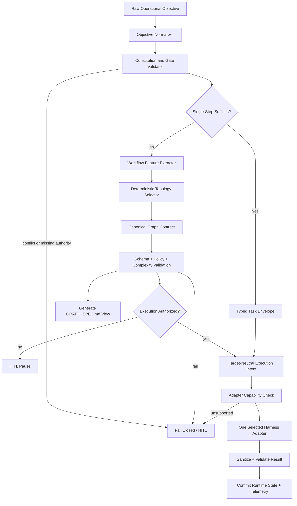

# META-GRAPH ENGINEERING TOOL — ARCHITECTURAL & MASTER IMPLEMENTATION PLAN

**Status:** `PENDING_HITL_APPROVAL`  
**Artifact class:** Architectural plan; declarative only  
**Implementation authorization:** Not granted  
**HITL gate:** `META_GRAPH_ARCHITECTURE_APPROVED_v1` (proposed; not issued)  
**Prepared:** 2026-08-04  
**Workspace:** `agentic-rd`  

> No runtime code, build script, package dependency, profile mutation, or executable graph is authorized by this document.

---

## 1. Core Recommendation

### Decision

Build the Meta-Graph Engineering Tool as an **embedded, independently bounded domain inside `agentic-rd`**.

`agentic-rd` owns:

- the canonical graph schema;
- topology-selection policy;
- deterministic validation and migration rules;
- generated graph artifacts;
- Agentic R&D policy/evaluation integration;
- adapter conformance tests.

A future standalone authoring product may emit an **untrusted candidate** for import, but it is not authoritative and may not write repository, Hermes profile, memory, or execution state directly.

### Why embedded wins

1. The repository already defines `specs/workflow_graph.yaml` as the machine-readable factory topology and binds validation to the constitution trio (`AGENTS.md`, `HARNESS_SPEC.md`, and `specs/workflow_graph.yaml`) (`specs/workflow_graph.yaml:968-984`).
2. Declarative specifications belong under `specs/`, while implementation remains disposable (`AGENTS.md:24-30`; `HARNESS_SPEC.md:133-140`).
3. Embedded ownership provides one schema owner, one policy boundary, one CI transaction, and one migration path.
4. A standalone product would create a second release stream and compatibility boundary before a second real consumer exists.
5. Cross-repository reuse remains possible later through an import adapter after demand is proven.

### Important correction to the requested `GRAPH_SPEC.md` contract

Two editable authorities are prohibited.

- **Canonical:** versioned machine YAML under the embedded graph-spec domain.
- **Generated:** `GRAPH_SPEC.md`, stamped `NON-NORMATIVE; DO NOT EDIT`, for human review and harness context.
- **Execution:** downstream builds consume the validated canonical YAML plus its digest, never Markdown prose alone.

This preserves the requested `GRAPH_SPEC.md` payload without allowing Markdown extraction or prose drift to control execution.

### Rejected alternatives

| Alternative | Verdict | Reason |
|---|---|---|
| Standalone Meta-Graph product now | Reject | Adds compatibility, release, security, and integration surfaces without a demonstrated second consumer. |
| Embedded skill as sole owner | Reject | A skill is optional UX/procedure; it must not own schema, policy, or migration state. |
| Framework-native graph as source of truth | Reject | LangGraph, AutoGen, ADK, n8n, and Temporal mix runtime concerns with topology and are not portable constitutional contracts. |
| Multi-framework runtime from launch | Reject | Creates unproven adapter/state planes and compounds latency, maintenance, and failure modes. |
| Full event-sourced/hash-chained state from launch | Reject | Durability, replay, and external-wait requirements have not yet justified the operational cost. |

---

## 2. Current Hard Blocker: G4 Authority Contradiction

Implementation must not begin until the G4 machine state is reconciled.

| Artifact | Current declaration |
|---|---|
| `AGENTS.md:162-164` | G4 approved; L3 enabled |
| `specs/g4_orchestration/MULTI_AGENT_TOPOLOGY.md:388-395` | Topology locked with `G4_TOPOLOGY_APPROVED_v1` |
| `specs/workflow_graph.yaml:404-418` | G4 `IN_PROGRESS`, `locked: false`, token only expected |
| `specs/workflow_graph.yaml:693-697` | L3 specialist disabled |
| `specs/g4_orchestration/workflow_graph.yaml:1-10` | `DRAFT_PRE_GATE`, awaiting token |

`specs/workflow_graph.yaml` is the stated machine-readable factory source of truth. Until reconciliation, the conservative executable interpretation is **G4 unavailable**, even though this architectural research plan may be completed.

### Required reconciliation outcome

One atomic specification change must:

1. declare G4 status in one authoritative machine field;
2. align root graph, domain graph, specialist enablement, prose status, and resume token;
3. define a validation invariant that fails on future status contradictions;
4. run existing G4 and root topology verifiers before implementation authorization.

---

## 3. System Boundary and Product Shape

### Embedded domain boundary

```text
agentic-rd
├── specs/
│   └── meta_graph/                 canonical schema, policy, fixtures, ADRs
├── src/agentic_rd/meta_graph/      future disposable implementation (post-HITL)
├── skills/software-development/
│   └── meta-graph-engineering/     optional triggering/operator procedure
├── tests/                          structural and behavioral verification
└── generated/<run-id>/             ephemeral or policy-retained outputs
    ├── GRAPH_SPEC.md               non-normative human/harness view
    ├── GRAPH_SPEC.yaml             validated canonical run contract
    └── execution-intent.*          target-neutral payload, when authorized
```

Paths are proposed architecture, not authorized file creation.

### Ownership rules

- Root `specs/workflow_graph.yaml` remains factory-level authority.
- The Meta-Graph domain may own one referenced, versioned domain schema.
- Authority flows one way: root constitution → domain schema → generated run contract → adapter payload.
- Generated artifacts never modify root policy, resume tokens, tool allowlists, budgets, or model tiers.
- Memory and Honcho may supply advisory context but may not mutate graph policy or schema.
- Profiles remain isolated; adapters receive explicit profile/workspace identity and environment allowlists.

---

## 4. System Architecture and Data Flow



### Pipeline stages

1. **Normalize objective** — canonical whitespace, declared constraints, acceptance criteria, risk and data classifications.
2. **Validate authority** — verify constitution, gate state, schema versions, workspace/profile boundary, and policy precedence.
3. **Apply single-step test first** — graph orchestration must prove why it is needed.
4. **Extract workflow features** — dependencies, branch independence, semantic routing, external waits, side effects, risk, independent evaluation, and durability needs.
5. **Select topology deterministically** — use precedence-ordered rules; LLMs may classify bounded semantic fields but cannot invent nodes or exceed caps.
6. **Construct canonical graph** — stable node IDs, typed edges, explicit joins/failures, budgets, and conditional feature sections.
7. **Validate complexity and policy** — reject unjustified nodes, unresolved joins, unbounded loops, gate bypasses, and unsupported adapter capabilities.
8. **Generate views** — create `GRAPH_SPEC.md` from the canonical contract; never parse it back as authority.
9. **Pause at HITL** — architecture, topology expansion, irreversible effects, egress, budget increases, and implementation authorization require human decisions.
10. **Render target-neutral intent** — graph semantics remain independent from Hermes/Codex/other syntax.
11. **Adapt and dispatch** — one adapter initially; unsupported semantics fail closed.
12. **Validate result and emit trajectory** — preserve Mission → Scene → rationale → Action → Observation → Verdict without requiring portable hidden reasoning.

---

## 5. Deterministic Topology Selection

### Complexity budget

MVP limits:

- one canonical machine schema;
- one embedded validator/compiler;
- one runtime and one harness adapter;
- default topology: single agent plus tools;
- maximum fan-out: `3`;
- maximum spawn depth: `1`;
- maximum bounded refinement iterations: `3`;
- no nested coordinators;
- no blackboard, swarm, runtime node invention, remote A2A, Temporal, n8n, or GraphRAG dependency in MVP;
- no generic adapter framework before a second adapter proves shared semantics.

Any element exceeding this budget must cite one justification: **dependency, isolation, durability, side-effect risk, or independent evaluation**.

### Single-step escape hatch

Use a typed single harness invocation when all are true:

1. one workspace;
2. one independently evaluable result;
3. no external wait;
4. no irreversible side effect;
5. no real parallel dependency.

Path:

```text
typed task envelope → one harness invocation → schema validation → result
```

No coordinator, graph runtime, persistent workflow state, adapter registry, or critic loop is permitted on this path.

### Minimal topology catalog

| Pattern | Selection predicate | Mandatory controls |
|---|---|---|
| Single agent + tools | Escape-hatch conditions hold | Tool allowlist, timeout, result schema, evaluation |
| Sequence | Total output-to-input dependency order | Typed stage contracts; failure path per stage |
| Parallel fan-out/fan-in | Branches are independent against one immutable snapshot | Width cap; stable result ordering; explicit `all`, `quorum`, or partial policy |
| Deterministic conditional route | Routing is expressible through typed fields/status/policy facts | Total predicate coverage; default and error branch |
| Bounded coordinator + leaves | Required subtasks cannot be enumerated before semantic decomposition | Maximum three non-delegating leaves; depth one; typed task envelopes; deterministic join |
| HITL overlay | Irreversible effect, egress, security/policy change, cap increase, or architecture gate | Persisted gate cursor; allowed decisions; expiry/cancel; fail-closed resume |
| Bounded refinement overlay | One artifact is evaluated against an independent stable rubric | Maximum iterations; quality exit; no-progress exit; escalation |

### Selection precedence

1. Apply HITL before privileged or irreversible actions.
2. Apply durability only if execution outlives process, waits externally, or needs crash-safe side-effect replay.
3. Test single-step eligibility.
4. Select sequence from dependencies.
5. Select parallel only from verified independence.
6. Use deterministic routing before semantic routing.
7. Add a coordinator only for bounded unknown decomposition.
8. Add refinement only for independent evaluation.
9. Reject blackboard/swarm unless separately authorized after MVP evidence.

---

## 6. Canonical Graph Contract

### Authority model

- Canonical format: machine YAML conforming to one exact schema version.
- `GRAPH_SPEC.md`: generated operator/harness view; non-normative.
- Node and edge order is canonical and stable.
- IDs derive from stable semantic paths, not timestamps.
- Runtime/framework extensions are namespaced bindings and cannot alter graph semantics.
- Hashes are deferred until an exact canonicalization standard is selected; “JCS-equivalent” is insufficient.

### Minimum required fields

```yaml
graph_spec:
  schema_version: graph-spec/1.0
  graph_id: stable-id
  graph_version: semver
  status: DRAFT | PENDING_HITL | APPROVED | RETIRED
  authority:
    parent_contract: specs/workflow_graph.yaml
    precedence: root_over_domain_over_generated
  entry: node-id
  terminals: [completed, failed, cancelled]
  nodes:
    - id: stable-id
      kind: agent | tool | transform | router | join | evaluator | hitl
      input_schema: schema-ref
      output_schema: schema-ref
      capability: capability-id
      side_effect_class: none | reversible | irreversible
  edges:
    - id: stable-id
      from: node-id
      to: node-id
      guard: unconditional | predicate-ref
      input_mapping: mapping-ref
      on_failure: failure-policy-ref
  caps:
    timeout_s: integer
    retries: integer
    concurrency: integer
    spawn_depth: integer
    token_limit: integer-or-null
    cost_limit_minor_units: integer-or-null
```

This is a declarative schema example, not implementation code.

### Conditional sections

Include only when used:

- `join` — members, success rule, timeout, cancellation, late result, failed-child, and partial-result behavior;
- `loop` — body, maximum iterations, quality exit, no-progress metric, and escalation;
- `hitl` — gate, trigger, decisions, expiry, resume target, and migration behavior;
- `durability` — backend requirement, checkpoint identity, idempotency, replay, and retention;
- `model_routing` — allowed capability tiers and escalation policy, never frozen model IDs;
- `adapter_binding` — target, adapter version, capability requirements, and unsupported-feature behavior.

### Model-routing policy

| Tier | Use | Constraint |
|---|---|---|
| Fast Flash | Deterministic classification assistance, formatting, validation summaries | Cannot authorize edges, gates, or budget changes |
| Strong Coding | Schema-to-artifact transformation, implementation payload authoring, structural critique | Post-HITL only for implementation payload generation |
| Premium Frontier | Ambiguous decomposition, architecture, threat analysis, synthesis | Selects only among bounded candidates; output remains validator-controlled |

Routing is dynamic by capability tier, matching `HARNESS_SPEC.md:8-10` and `AGENTS.md` model policy.

---

## 7. Shared State Vector \(S_t\)

### Definition

For MVP, \(S_t\) is the minimal validated runtime projection needed to continue the graph. It is not a universal event-sourced ledger.

```yaml
shared_state:
  schema_version: ssv/1.0
  run_id: stable-run-id
  graph:
    id: graph-id
    version: graph-version
    spec_digest: optional-until-canonicalization-defined
  cursor:
    active_nodes: [node-id]
    node_statuses: {}
  attempts: {}
  budgets:
    token_consumed: integer
    tool_calls_consumed: integer
    elapsed_ms: integer
    cost_minor_units: integer-or-null
  artifacts:
    inputs: [artifact-ref]
    results: [artifact-ref]
  failure: null-or-failure-record
  hitl: null-or-hitl-cursor
  durability:
    enabled: false
    checkpoint_version: null
```

### State invariants

- Runtime state cannot weaken graph caps or policy.
- Child-agent output enters parent state as a sanitized, typed Observation only.
- Plain text cannot satisfy a typed join without deterministic validation/transformation.
- Parallel results serialize in stable branch/node order.
- Budget arithmetic and edge guards are deterministic.
- Memory is advisory context, never graph-policy authority.
- Compaction changes model view, not retained session evidence (`SESSION_STATE_SPEC.md:231-235`).

### Optional durable mode

Durable state is added only if a workflow:

- outlives the invoking process;
- waits on an external actor;
- must recover after process/host failure; or
- may repeat a side effect on retry/resume.

Only then add an exact event schema, checkpoint version, compare-and-append behavior, idempotency, outbox semantics, retention, and replay ownership. Choose one durability owner; do not layer Temporal, graph checkpoints, and n8n waits simultaneously.

### HITL cursor

Persist only:

- `gate_id`;
- paused graph version/digest and state/checkpoint identity;
- allowed decisions and decision schema;
- resume node;
- expiry and cancellation behavior;
- single-use decision identity.

Resume fails closed if graph, policy, sandbox profile, or adapter capabilities changed while paused. Migration requires a new human-visible decision.

---

## 8. Agentic R&D Handshake

### Target-neutral execution intent

Minimum envelope:

```yaml
execution_intent:
  contract_version: execution-intent/1.0
  run_id: stable-run-id
  node_id: node-id
  attempt: integer
  workspace:
    cwd: explicit-wsl-path
    profile_id: explicit-profile
  mission_ref: artifact-ref
  context_refs: [artifact-ref]
  expected_result_schema: schema-ref
  tool_allowlist: [tool-id]
  environment_allowlist: [variable-name]
  sandbox_policy: policy-ref
  timeout_s: integer
  budgets: {}
  idempotency_key: null-or-required-for-retryable-side-effect
```

### Deterministic payload lifecycle

1. Validate graph, runtime state, gate, profile, sandbox, and adapter capability.
2. Build target-neutral execution intent.
3. Render adapter payload ephemerally.
4. Persist intent identity before dispatch only for retryable side effects.
5. Dispatch once.
6. Sanitize and schema-validate the result.
7. Commit node status, artifacts, budget use, Observation, and Verdict.
8. Retain payload only when audit policy requires it; otherwise retain normalized references and approved telemetry.

Adapters may change syntax only. They cannot:

- add nodes or tools;
- increase token, cost, time, retry, fan-out, or depth caps;
- relax sandbox/profile boundaries;
- bypass HITL;
- reinterpret joins;
- change model capability tier;
- rewrite acceptance criteria;
- silently omit unsupported fields.

### Initial adapter decision

**Initial adapter: Hermes**, because it is the active local harness and already owns project context, tools, delegation, profile isolation, and HITL interaction.

However, implementation Phase 0 must verify Hermes’ actual machine-facing contract for:

- structured final results;
- stdout/stderr and exit semantics;
- timeout and cancellation;
- continuation/resume handles;
- profile and workdir binding;
- delegation durability limits.

Until verified, a wrapper-owned result envelope must fail closed on typed outputs. `delegate_task` is not a durability mechanism because children are process-local.

### Deferred adapters

| Target | Status | Condition to add |
|---|---|---|
| Codex | Second candidate | Add after Hermes; validate JSONL lifecycle events and output-schema behavior against current official CLI contract. |
| OpenClaw | Deferred | Add only after capability/profile isolation contract tests and a real use case. |
| Antigravity | Deferred/unknown | No authoritative stable machine-output contract established; plain text cannot satisfy typed joins directly. |
| n8n | Not an agent adapter | Consider only as an outer integration/approval plane when connector breadth is required. |
| LangGraph/ADK | Runtime bindings, not harnesses | Add only if native implementation needs cyclic/checkpoint graph execution. |
| Temporal | Durability plane | Add only after durable-mode requirements are proven. |
| GraphRAG | Knowledge node | Add only for demonstrated corpus indexing/retrieval requirements. |

---

## 9. Deterministic vs Model vs Human Authority

| Deterministic system | Model advisory/bounded choice | Human only |
|---|---|---|
| Schema parsing and referential integrity | Objective decomposition | Architecture approval/resume token |
| Gate/status consistency checks | Semantic classification | Irreversible/high-stakes authorization |
| Typed edge predicates and default branches | Selection among allowlisted topology candidates | New tool/adapter/remote capability authorization |
| Budget/cap arithmetic | Specialist selection from bounded registry | Budget, fan-out, depth, or loop-cap increase |
| Join ordering and declared failure policy | Rubric-based critique | Egress/publication/release approval |
| Sandbox/profile/tool allowlists | Human-readable synthesis | Circuit-breaker reset |
| Adapter capability compatibility | Proposed implementation payload | Any L4 enablement |
| Secret/PII scanning | Concise rationale | Migration of paused run to changed graph/policy |

Persist a concise decision rationale or protected trace reference, not mandatory portable hidden reasoning. Current raw `thought` fields (`EVALUATION_HARNESS_SPEC.md:40-47,66`) require normalization before implementation.

---

## 10. Skeptic Rules

The Skeptic is not a mandatory agent node in every generated graph. It is an evaluation function or bounded independent node only when justified.

Invoke Skeptic review when one or more apply:

- architecture or topology changes;
- more than one agent is proposed;
- a loop is proposed;
- an adapter cannot express a required invariant;
- partial results may influence synthesis or release;
- irreversible side effects, egress, security, payment, or policy changes exist;
- evidence sources conflict;
- no-progress threshold is reached;
- implementation would exceed the complexity budget.

Skeptic output must be typed:

- `ACCEPT` — proposal survives unchanged;
- `MODIFY` — survives with explicit conditions;
- `REJECT` — removed from synthesis;
- `BLOCK` — unresolved authority/security/data-integrity issue.

No generic debate loop is allowed. Domain-specific debate requires explicit evidence fields, a bounded round count, independent exit criteria, and its own authorization.

---

## 11. Known Contract Defects to Resolve

| Defect | Evidence | Required disposition |
|---|---|---|
| G4 authority contradiction | Root/domain machine state conflicts with approved prose | Blocking reconciliation before implementation |
| Trust-threshold comments | `0.85` and `0.70` are mislabeled as 5% and 15% degradation | Decide whether values or comments are authoritative; correct atomically |
| Join semantics | G4 `all_success`; G9 permits partial continuation | Declare policy per join, including timeout/late/cancel behavior |
| State enum drift | G4 `RUNNING`; G9 `IN_PROGRESS` | Define canonical enum and migration aliases |
| Portable raw reasoning | G5 requires raw `thought` | Replace portable field with concise rationale/protected trace reference |
| Hash infrastructure incomplete | Existing placeholder/first-lock hash semantics; proposed canonicalization underspecified | Select exact standard only when digest/replay requirement is approved |
| Adapter machine contracts | Hermes structured envelope unproven; Antigravity plain-text only | Verify initial adapter; fail unsupported fields closed |
| Payload retention | No canonical retention/redaction/replay policy | Define before dispatch implementation |

---

## 12. Pre-Flight Telemetry and Resource Estimate

### Existing substrate

| Resource | Verified state | MVP implication |
|---|---|---|
| Workspace | WSL2 Ubuntu 24.04, Linux-native repository | Keep all project execution inside WSL2 |
| Python | Project venv `.venv-hermes`; package supports Python 3.10–3.12 | No host-Windows Python |
| Tests | `pytest` configured under `tests/` | Extend existing suite after approval |
| Harness | Hermes + Antigravity declared; Codex available | Start with Hermes adapter only |
| Multi-agent caps | Width `3`, depth `1` in G4 domain graph | Treat as hard maximum |
| Package dependencies | No runtime dependency list beyond packaging metadata in `pyproject.toml` | Prefer standard library/native schema tools first; approve dependencies separately |
| GPU | Not required for schema compilation/validation | No local VRAM allocation required for MVP |

### Model/API estimate

Because model routing is dynamic by capability tier and provider pricing changes independently, this plan does not freeze model IDs or fabricate dollar rates.

Planning envelopes per graph-generation run:

| Objective class | Expected model shape | Planning token envelope | Cost control |
|---|---|---:|---|
| Single-step | One classification/normalization pass | 5k–20k total tokens | Fast/strong tier; no research fan-out |
| Deterministic sequence/conditional | Normalize + bounded semantic classification + validation summary | 15k–50k | One premium call maximum unless ambiguity persists |
| Parallel specialists/coordinator | Planner + up to three leaves + one synthesis/audit | 50k–180k | Width 3; no nested delegation; hard run ceiling |
| Architecture/research workflow | Planner + three research leaves + Skeptic + synthesis | 100k–350k | Explicit HITL budget; citations and context dominate |

These are **planning estimates**, not measured benchmarks. Before each run, the tool must calculate:

```text
estimated_cost =
  Σ[(input_tokens_tier × live_input_rate_tier)
    + (output_tokens_tier × live_output_rate_tier)]
```

The live adapter/provider catalog supplies rates at execution time. If rates are unavailable, dollar cost remains `UNKNOWN` and the run requires either a token-only ceiling or HITL approval.

### API constraints

- Provider/model context windows and rates must be discovered at run time.
- No API credentials enter graph specs, prompts, logs, payloads, or generated Markdown.
- Hermes profile/environment allowlists determine credential access.
- Antigravity cannot be used for typed joins until a deterministic output-validation path exists.
- Long-running research cannot rely on process-local delegation for durability.
- External URLs and retrieved evidence remain untrusted data and require citation/provenance handling.

### Dependency posture

MVP dependency selection is deferred to post-HITL Phase 0. Native Python/YAML capabilities and existing repository tooling are evaluated first. LangGraph, Temporal, n8n, GraphRAG, AutoGen, and ADK are not MVP dependencies by default.

---

## 13. Master Implementation Plan

Implementation phases are authorized only after the architecture resume token and the G4 contradiction are resolved.

### Phase 0 — Authority and Contract Reconciliation

**Goal:** establish a non-contradictory constitutional base.

Deliverables:

- atomic G4 status reconciliation;
- graph authority/precedence ADR;
- canonical lifecycle enums;
- corrected trust-threshold semantics;
- per-join policy rules;
- raw-reasoning portability decision;
- Hermes adapter contract spike report;
- payload retention/redaction policy.

Exit telemetry:

- root/domain topology validation green;
- no contradictory gate statuses;
- all schema owners and generated artifacts named;
- initial adapter capabilities VERIFIED or implementation blocked.

### Phase 1 — Durable Specifications and Acceptance Tests

**Goal:** define the graph tool without runtime implementation.

Deliverables:

- graph schema specification;
- topology-selection decision table;
- minimal `S_t` schema;
- execution-intent schema;
- HITL cursor schema;
- failure/join/loop contracts;
- Gherkin acceptance scenarios;
- fixture objectives and expected canonical graphs;
- complexity-budget validator specification.

Exit telemetry:

- schemas parse;
- fixtures cover every MVP topology and escape hatch;
- invalid/bloated/gate-bypassing graphs fail deterministically;
- no framework dependency embedded in canonical schema.

### Phase 2 — Deterministic Compiler/Validator MVP

**Goal:** transform normalized objectives into validated canonical graph contracts and generated Markdown views.

Scope:

- single-step, sequence, parallel, deterministic conditional, bounded coordinator, HITL/refinement overlays;
- stable IDs and ordering;
- schema and referential validation;
- complexity budget enforcement;
- generated `GRAPH_SPEC.md` marked non-normative;
- no execution dispatch.

Exit telemetry:

- golden fixtures byte-stable across repeated runs after normalized semantic decisions are fixed;
- malformed joins/loops/gates rejected;
- Markdown regeneration detects no drift;
- pytest and repository verifiers green.

### Phase 3 — Hermes Execution-Intent Adapter

**Goal:** render one validated node into a bounded Hermes request and normalize its result.

Scope:

- explicit WSL workdir/profile;
- tool/environment/sandbox allowlists;
- timeout, budget, and cancellation;
- wrapper-owned typed result envelope;
- no durable external waits;
- no irreversible side effects until idempotency policy is proven.

Exit telemetry:

- contract tests for success, schema failure, timeout, cancellation, needs-input, unsupported capability, and profile mismatch;
- adapter cannot increase capabilities or caps;
- plain text alone cannot satisfy typed joins.

### Phase 4 — End-to-End Evaluation and Adversarial Tests

**Goal:** prove topology selection is simpler than alternatives and policy-safe.

Evaluation set:

- tasks that must collapse to single-step;
- strict sequences;
- independent parallel research;
- false-parallel shared-write case;
- deterministic route and missing-default failure;
- bounded unknown decomposition;
- critic stagnation;
- child timeout/late result/partial evidence;
- HITL pause/resume with changed graph;
- G4 status contradiction fixture;
- tool/profile/environment expansion attempts.

Exit telemetry:

- zero unauthorized topology expansion;
- zero silent adapter field omission;
- all joins deterministic under declared policy;
- no graph runs beyond caps;
- evidence pack includes trajectory, costs, failures, and rollback.

### Phase 5 — Second Adapter Decision Gate

Add Codex only if a real workload demonstrates value and Hermes adapter semantics are stable. Extract a common adapter interface only after two implementations prove common behavior.

### Phase 6 — Optional Durability and External Authoring

Separate gates govern:

- durable workflow backend/checkpointing;
- external waits;
- n8n integration;
- Temporal;
- GraphRAG knowledge nodes;
- standalone untrusted authoring/import;
- remote A2A;
- broader topology catalog.

None is implied by MVP approval.

---

## 14. Verification Strategy

### Structural checks

- canonical schema parses;
- node/edge references resolve;
- entry/terminal reachability;
- no orphan nodes;
- cycles require bounded loop declarations;
- joins define failure, timeout, late-result, cancellation, and partial policies;
- HITL edges preserve resume semantics;
- caps comply with root constitution;
- model routing uses capability tiers only;
- generated Markdown matches canonical YAML and is marked non-normative.

### Determinism checks

- same normalized objective + policy + accepted semantic decisions → same IDs, ordering, topology, and generated view;
- parallel completion order cannot change serialized result order;
- timestamps and runtime IDs do not influence topology selection;
- unsupported adapter features fail closed;
- LLM output cannot directly authorize graph mutation.

### Security checks

- no secrets/credentials in artifacts;
- explicit WSL workspace and profile identity;
- environment/tool allowlists;
- no cross-profile write;
- external evidence taint/provenance retained;
- output/result schema validation;
- payload retention and redaction enforced;
- irreversible retries require idempotency and HITL.

### Copy-paste verification path for this plan

```bash
wsl -d Ubuntu-24.04 bash -l -c '
  set -euo pipefail
  cd /home/carlospg/workspace/agentic-rd
  test -s META_GRAPH_TOOL_ARCHITECTURAL_PLAN.md
  grep -q "Status:.*PENDING_HITL_APPROVAL" META_GRAPH_TOOL_ARCHITECTURAL_PLAN.md
  grep -q "Core Recommendation" META_GRAPH_TOOL_ARCHITECTURAL_PLAN.md
  grep -q "System Architecture and Data Flow" META_GRAPH_TOOL_ARCHITECTURAL_PLAN.md
  grep -q "Shared State Vector" META_GRAPH_TOOL_ARCHITECTURAL_PLAN.md
  grep -q "Agentic R&D Handshake" META_GRAPH_TOOL_ARCHITECTURAL_PLAN.md
  grep -q "Pre-Flight Telemetry and Resource Estimate" META_GRAPH_TOOL_ARCHITECTURAL_PLAN.md
  grep -q "Master Implementation Plan" META_GRAPH_TOOL_ARCHITECTURAL_PLAN.md
  grep -q "Human Approval Gate" META_GRAPH_TOOL_ARCHITECTURAL_PLAN.md
  git diff --check -- META_GRAPH_TOOL_ARCHITECTURAL_PLAN.md
'
```

---

## 15. Evidence Base

### Local authoritative evidence

- `AGENTS.md`
- `HARNESS_SPEC.md`
- `specs/workflow_graph.yaml`
- `specs/g2_tools/TOOL_CALL_SEQUENCE.md`
- `specs/g3_memory/SESSION_STATE_SPEC.md`
- `specs/g4_orchestration/MULTI_AGENT_TOPOLOGY.md`
- `specs/g4_orchestration/workflow_graph.yaml`
- `specs/g4_orchestration/GHERKIN_DECOMPOSITION_TEMPLATES.md`
- `specs/g5_evaluation/EVALUATION_HARNESS_SPEC.md`
- `specs/g5_evaluation/CIRCUIT_BREAKER_RULES.yaml`
- `specs/g9_research/RESEARCH_LOOP_ARCHITECTURE.md`
- `specs/g9_research/HYPOTHESIS_DSL_SPEC.md`
- `specs/g9_research/operators.yaml`
- `specs/g10_production/PRODUCTION_AGENTOPS_BLUEPRINT.md`
- `pyproject.toml`

### Current primary framework sources

- LangGraph: https://github.com/langchain-ai/langgraph and https://docs.langchain.com/oss/python/langgraph/persistence
- AutoGen GraphFlow: https://microsoft.github.io/autogen/stable/user-guide/agentchat-user-guide/graph-flow.html
- Microsoft GraphRAG: https://github.com/microsoft/graphrag
- n8n: https://docs.n8n.io/hosting/scaling/queue-mode/ and https://docs.n8n.io/sustainable-use-license/
- Google ADK workflows: https://adk.dev/agents/workflow-agents/
- Temporal: https://docs.temporal.io/temporal
- Hermes Agent: https://hermes-agent.nousresearch.com/docs/
- Codex non-interactive mode: https://developers.openai.com/codex/noninteractive.md
- OpenClaw agent CLI: https://docs.openclaw.ai/cli/agent.md

### Evidence classifications

- **VERIFIED:** directly supported by current local contracts or cited primary documentation.
- **INFERRED:** engineering recommendation derived from verified constraints.
- **UNKNOWN:** no authoritative/stable contract established; excluded or gated.

---

## 16. Human Approval Gate

### Decision requested

Approve or reject the following bounded architecture:

1. **Embedded ownership** inside `agentic-rd`.
2. Root/domain machine YAML is authoritative; `GRAPH_SPEC.md` is generated and non-normative.
3. Single-step execution is the default escape hatch.
4. MVP topology catalog is limited to sequence, parallel, deterministic conditional, bounded coordinator, HITL, and bounded refinement.
5. One initial Hermes adapter; all others deferred.
6. No event sourcing/durability framework until a demonstrated requirement.
7. G4 status reconciliation is a mandatory Phase 0 blocker.
8. No implementation starts until explicit approval.

### Key risks requiring acknowledgment

- G4 is contradictory across binding artifacts.
- Duplicate graph representations would drift if both were editable.
- Multi-agent topology can add unjustified token cost and latency.
- Hermes structured machine-output behavior requires verification.
- Partial-result joins can silently contaminate synthesis without per-join policy.
- Retry/resume can duplicate side effects without idempotency.
- Paused runs become unsafe if graph/policy/profile changes silently.
- Raw reasoning retention creates privacy/portability exposure.
- Provider pricing and context constraints are dynamic; dollar costs require live discovery.

### Gate state

```yaml
HITL_GATE:
  id: META_GRAPH_ARCHITECTURE_APPROVAL
  status: PENDING
  implementation_allowed: false
  proposed_resume_token: META_GRAPH_ARCHITECTURE_APPROVED_v1
  accepted_decisions:
    - APPROVE
    - REJECT
    - REQUEST_REVISION
  approval_effect:
    - authorize Phase 0 reconciliation only
    - do not implicitly authorize later phases or production execution
```

**HARD STOP:** Do not generate implementation code, build scripts, runtime adapters, package changes, or executable payloads until the human explicitly issues the approval decision and required resume token.
