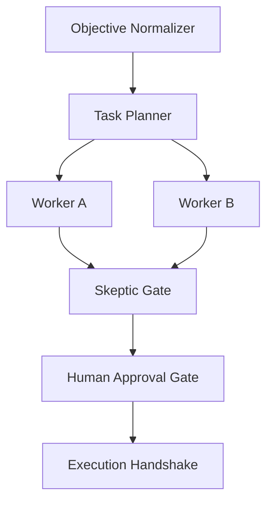

# Meta-Graph Engineering

## Overview

Use this skill to convert a raw operational objective into the smallest valid graph topology inside the isolated `specs/meta_graph/` overlay. The overlay is additive: it never modifies `AGENTS.md`, `HARNESS_SPEC.md`, or `specs/workflow_graph.yaml`.

Canonical execution data is `GRAPH_SPEC.yaml`. `GRAPH_SPEC.md` is a generated, non-normative human and harness review view. It must exactly represent canonical node IDs and directed edges.

## When to Use

Use when the request includes:

- plan graph workflow;
- graph engineering;
- map agentic pipeline;
- choose parallel workers, critic, skeptic, or HITL gate;
- produce `GRAPH_SPEC.yaml` or a Mermaid topology diagram.

Do not use for a single mechanical action unless the caller explicitly requests a graph artifact. The single-step escape hatch is available only to explicitly read-only objectives; ambiguous or side-effecting objectives must not bypass graph evaluation.

## Authority and Scope

| Artifact | Role |
|---|---|
| `specs/meta_graph/OVERLAY_POLICY.yaml` | Local routing limits and non-invasive boundary |
| `specs/meta_graph/canonical_schema.yaml` | Required canonical graph fields and invariants |
| `specs/meta_graph/topology_catalog.yaml` | Permitted minimal topology patterns |
| `GRAPH_SPEC.yaml` | Canonical machine contract |
| `GRAPH_SPEC.md` | Generated non-normative review view |

Hard boundaries:

1. Treat root constitution files as read-only.
2. Apply local G4/L3 overrides only while compiling or validating `specs/meta_graph/` artifacts.
3. Never exceed width `3` or depth `1`.
4. Never enable L4, remote A2A, blackboard, swarm, or nested orchestration through this overlay.
5. Do not dispatch execution from a graph-compilation step.

## Procedure

### 1. Normalize the objective

Extract the objective, acceptance criteria, side-effect class, external waits, parallel dependencies, required evidence, and requested HITL boundary.

Completion criterion: objective is non-empty and its success condition is expressible as a typed result.

### 2. Apply the single-step escape hatch first

Select `single_step` only when all are true:

- the objective begins with an explicitly read-only verb: `check`, `describe`, `inspect`, `list`, `read`, `show`, `summarize`, or `validate`;
- one workspace;
- one independently evaluable result;
- no external wait;
- no irreversible or egress side effect;
- no genuine parallel dependency.

Unknown, state-changing, irreversible, authorization, production, or egress objectives must select a graph topology and require HITL when high stakes.

Output a typed task envelope, not a graph runtime.

Completion criterion: `topology: single_step`, `nodes: []`, and `edges: []`.

### 3. Select the smallest catalog pattern

| Pattern | Use only when | Required control |
|---|---|---|
| `sequence` | Output of one stage is required by the next | Typed stage contract and failure path |
| `parallel_fan_out_fan_in` | Branches are independent against an immutable input snapshot | Explicit deterministic join policy |
| `skeptic_audit` | Worker findings require adversarial review before synthesis | Typed worker output and skeptic rubric |
| `hitl_approval` | High-stakes, irreversible, egress, cap change, or authorization decision exists | Explicit user resume token |

Do not add a coordinator, loop, critic, or additional adapter unless the selected topology requires it and the reason is documented as dependency, isolation, durability, side-effect risk, or independent evaluation.

Completion criterion: every non-single-step node has a stated justification and remains within the overlay complexity budget.

### 4. Build canonical `GRAPH_SPEC.yaml`

Populate every required field from `canonical_schema.yaml`:

```yaml
schema_version: graph-spec/1.0
graph_id: stable-id
status: DRAFT | PENDING_HITL | APPROVED | REJECTED
entry_node: node-id-or-null
nodes: []
edges: []
complexity_budget:
  max_spawn_width: 3
  max_spawn_depth: 1
  max_refinement_iterations: 3
hitl_gate:
  required: false
  resume_token: null
  token_policy: issuer_generated_single_use  # required only when hitl_gate.required is true
```

For non-single-step graphs, node IDs must be stable and every edge endpoint must exist. Add join, failure, loop, durability, and adapter sections only when that graph uses those capabilities. Write generated `GRAPH_SPEC.yaml` and `GRAPH_SPEC.md` only inside `specs/meta_graph/` or a child directory; reject path traversal or external output paths.

Completion criterion: schema, reference, cap, and gate invariants validate deterministically.

### 5. Compile `GRAPH_SPEC.md`

Render Markdown from the canonical YAML. Do not edit generated Markdown to alter topology. Mark it non-normative and regenerate it after canonical graph changes.

### 6. Generate the exact Mermaid diagram

`GRAPH_SPEC.md` **must** contain one syntactically valid fenced `mermaid` block. It must render the exact node IDs and directed edges from canonical `GRAPH_SPEC.yaml`.

Required structure:

````markdown
# Graph Architecture View: [Graph ID]

## Topology Diagram



## Shared State Vector ($S_t$)

```yaml
graph_id: [Graph ID]
status: PENDING_HITL
topology: skeptic_audit
hitl_required: true
```
````

Rules:

- Include `graph TD`.
- Declare every canonical node exactly once.
- Render every canonical edge as `from --> to`.
- Do not add visual-only nodes or edges.
- Keep Mermaid labels free of unescaped syntax characters.
- Use pure Markdown and YAML; do not use XML or HTML tags.

Completion criterion: automated tests prove every canonical node ID and edge appears in the Mermaid block.

### 7. Validate and stop at the gate

Run the dedicated overlay test suite through the WSL project interpreter:

```bash
wsl -d Ubuntu-24.04 bash -l -c 'cd /home/carlospg/workspace/agentic-rd && .venv-hermes/bin/python3 -m pytest tests/test_meta_graph_overlay.py -q'
```

For a graph with `hitl_gate.required: true`, stop after rendering and present the graph, risk/cost limits, and allowed decisions. The compiler must leave `resume_token` null; an external approval issuer creates a graph-bound, single-use token only after the human decision. Execution occurs only after that issued token validates.

Completion criterion: tests are green, protected root files remain unchanged, and no execution payload is dispatched before HITL approval.

## Common Pitfalls

1. **Treating `GRAPH_SPEC.md` as authoritative.** Edit canonical YAML and regenerate Markdown.
2. **Using parallelism for duplicated work.** Parallel branches need independent inputs and an explicit join.
3. **Skipping the escape hatch.** Simple tasks must not pay graph latency or token cost.
4. **Allowing local G4 override to leak.** The override belongs only to `specs/meta_graph/` compilation and validation.
5. **Mermaid drift.** A diagram that differs from canonical nodes/edges is a defect, not a cosmetic issue.
6. **Raw hidden reasoning in shared state.** Store a concise rationale or protected trace reference instead.

## Verification Checklist

- [ ] Root constitution files have no diff from `HEAD`.
- [ ] Overlay policy remains scoped to `specs/meta_graph/`.
- [ ] Topology is the smallest catalog pattern satisfying the objective.
- [ ] Canonical graph has all required fields.
- [ ] Width and depth remain within `3` and `1`.
- [ ] `GRAPH_SPEC.md` is generated from canonical YAML.
- [ ] Mermaid nodes and directed edges exactly match canonical graph data.
- [ ] HITL graph execution stops pending a valid resume token.
- [ ] Dedicated overlay tests pass through `.venv-hermes/bin/python3`.
