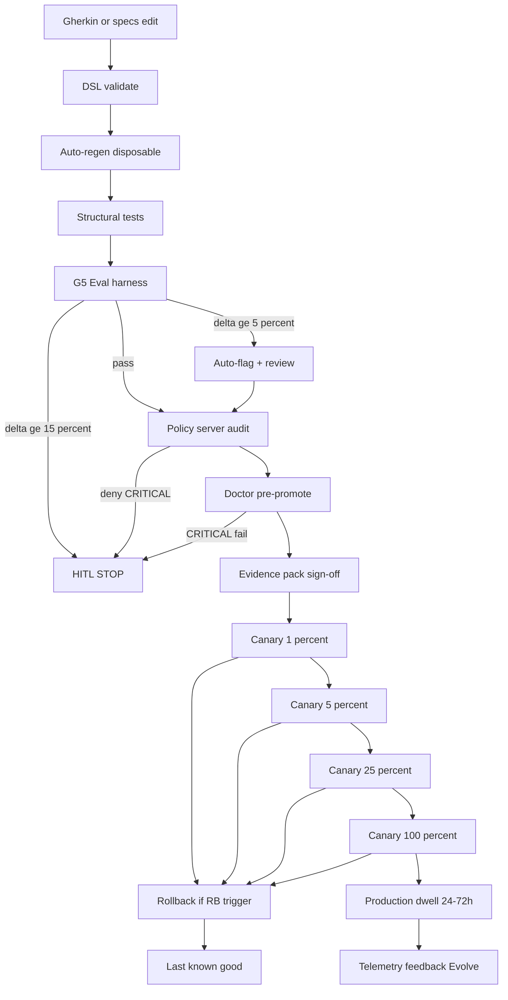

# PRODUCTION_AGENTOPS_BLUEPRINT.md
# G10 — Production AgentOps Deep Specification (Step A)
# Status: DRAFT_PRE_GATE
# Overlay: OPTION_2_STANDARD
# Upstream: research-loop-v1.0.0 (G9 LOCKED) · lock commit 6299812
# BLUE resume (authoritative): G10_PRODUCTION_DEPLOY_v1
# Domain gate posture: HARD_STOP_IMMEDIATE (FINAL GATE) after Steps E–F readiness
# Tier: Premium Frontier (Step A)
#
# Anchors:
#   BLUE §G10 L479–519 — Spec-driven CI/CD, Vertex/Cloud Run, live policy server,
#     OTEL, automatic rollback, Doctor checks, evidence packs, cultural safeguards
#   WP-F5 Prototype to Production — Evaluation-gated deployment, 3-phase CI/CD,
#     canary 1% start, Observe→Act→Evolve, AgentOps lifecycle, Agent Engine / Cloud Run
#   WP-S1 Factory Model — Agent = Model + Harness; harness correctness-by-construction
#   WP-S4 Effective Trust — trust decay, circuit breakers, zero ambient authority
#   WP-S5 Spec-Driven Development — Gherkin durable; code disposable
#   Course-2 supersedes Course-1 on overlap

version: 1.0.0-draft
domain: G10
kind: production_agentops_blueprint
status: DRAFT_PRE_GATE
overlay: OPTION_2_STANDARD
upstream_tag: research-loop-v1.0.0
upstream_lock_commit: "6299812"
blue_resume_token: G10_PRODUCTION_DEPLOY_v1
authoritative_upstream_resume: G9_RESEARCH_FLEET_LOCKED_v1

---

## 1. Document Context Summary & Target

**Normalized domain:** Spec-driven CI/CD (push to `.gherkin` → regenerate → eval harness → policy server audit → canary rollout → production → telemetry feedback), Vertex AI Agent Engine / Google Cloud Run / serverless runtime targets, enterprise policy server on the **live path**, OpenTelemetry production monitoring, automatic rollback, Doctor environment checks, release evidence packs, cultural safeguards (approval fatigue, token-maxing avoidance), and a shared accountability model.

**Ultimate engineering objective:** Full production-grade AgentOps system that treats the **Gherkin specification as the durable artifact**, keeps **code disposable**, and requires only **one final strategic HITL gate** for release (`G10_PRODUCTION_DEPLOY_v1`).

**Non-goals (OPTION_2):**
- Immediate 100% traffic with live self-improvement loops (OPTION_3)
- Infinite postponement / lab-only forever (OPTION_1)
- L4 AgentCreator enablement (still separately gated beyond G7)
- Silent constraint relaxation of any G1–G9 C-* ID

---

## 2. Course-1 → Course-2 Crosswalk (Production)

| Topic | Course-1 (WP-F*) | Course-2 supersession (WP-S*) | G10 binding |
|---|---|---|---|
| Prototype→prod journey | WP-F5 AgentOps lifecycle, CI/CD, canary, Observe/Act/Evolve | WP-S1 Factory + surfaces; WP-S5 SDD (spec durable) | Spec-first pipeline; code regen disposable |
| Quality & trust | WP-F4 trajectory/judge/OTEL intro | WP-S4 Effective Trust, trust decay, AgBOM, circuit breakers | G5 mechanisms **enforced** in prod path |
| Security & policy | WP-F5 SAIF layers, HITL | WP-S4 zero ambient authority, hybrid policy server | G8 policy server **live path only**; LLM never final authority on LLM06 |
| Orchestration | WP-F5 A2A Agent Cards | WP-S2 A2A task SM (GOTO avoidance) | G4 fleet under canary load |
| Research product path | — | G9 Gherkin hypothesis + fail-closed citations | CI gates C-RS-* before canary |

---

## 3. Inherited Constraint Catalog Touchpoints

Production **must not relax**. It may only tighten.

| Layer | Constraint families | Production enforcement seat |
|---|---|---|
| G1 | Glass-box, sandbox, fail-fast, dynamic tiers only | Release constitution + Doctor boundary probes |
| G2 | T1+T2 procurement; broker ACL; pin concurrence | Image build + runtime tool pin audit |
| G3 | Co-load budgets; progressive disclosure | Token budget gate + memory health Doctor |
| G4 | Hierarchical coordinator; policy intercept seat | Fleet canary A2A handshake SM |
| G5 | Trajectory truth; 5%/15%; trust/circuit/AgBOM | Eval stage + live trust decay monitoring |
| G6 | Dune vs production modes; SDD hybrid MD+YAML | Branch policy: `prototype/*` never promotes without TT-05 |
| G7 | HB-01–HB-10; L4 off; loop budget | Improvement PRs only via SDD + HITL for S1/S2 |
| G8 | C-MT-*; ISO-1/2/3; SPIFFE; non-delegatable LLM06 | Live policy server + SVID Doctor |
| G9 | C-RS-01–C-RS-08; 7 HG-RS gates; citation fail-closed | Research product release path + citation gate |

**New G10 constraint IDs (catalog additions):**

| ID | Rule |
|---|---|
| C-PA-01 | Gherkin (or hybrid MD+YAML under `specs/`) is the durable release unit; generated code is disposable |
| C-PA-02 | No production traffic without cleared mandatory HITL gates and signed evidence pack |
| C-PA-03 | Canary progression fixed schedule 1% → 5% → 25% → 100% under OPTION_2; no jump-skip |
| C-PA-04 | Auto-rollback on circuit trip, policy violation surge, or trust decay **>15%** from canary baseline |
| C-PA-05 | Enterprise policy server is on the **live request path** (not advisory-only); OWASP LLM06 checks non-delegatable |
| C-PA-06 | OTEL traces/metrics/logs mandatory for every production invocation (sample rates in fleet_management) |
| C-PA-07 | Doctor checks must pass pre-promote and continuously in prod (fail-closed on CRITICAL probes) |
| C-PA-08 | Cultural safeguards: no approval batching >N/hour without secondary reviewer; bans metric gaming (token-maxing) |

---

## 4. Spec-Driven CI/CD Pipeline Lifecycle

Durable source of truth: `.gherkin/**` scenarios + `specs/**` declarative packs.  
Implementation (codegen, containers, bindings) is **disposable** per WP-S5.

```
┌────────────┐   push/edit    ┌──────────────┐   validate    ┌─────────────┐
│  Gherkin   │ ─────────────► │ Spec lint +  │ ────────────► │ Auto-regen  │
│  + specs/  │                │ DSL parse    │               │ (disposable)│
└────────────┘                └──────────────┘               └──────┬──────┘
                                                                     │
         ┌─────────────────────────────◄─────────────────────────────┘
         ▼
┌────────────────┐   dual-judge    ┌──────────────────┐   non-delegatable
│ Eval harness   │ ──────────────► │ Policy server    │ ──────────────►
│ (G5 golden +   │   5%/15% gates  │ audit (G8 live)  │   LLM06 + ACL
│  FM scenarios) │                 └──────────────────┘
└────────────────┘                           │
         ▲                                   ▼
         │                          ┌──────────────────┐
         │                          │ Canary rollout   │ 1→5→25→100
         │                          │ + Doctor checks  │
         │                          └────────┬─────────┘
         │                                   ▼
         │                          ┌──────────────────┐
         │   feedback (OTEL,        │ Production       │
         └───────────────────────── │ + telemetry FB   │
             AgBOM, trust decay)    └──────────────────┘
```

### 4.1 Lifecycle stages (normative)

| Stage | ID | Trigger | Owner harness | Exit criteria |
|---|---|---|---|---|
| Spec edit | STG-01 | Push to `.gherkin/**` or `specs/**` on release branch | H_CONTEXT | Structural DSL valid (PRODUCTION_DSL_SPEC) |
| Spec lint | STG-02 | Auto on STG-01 | H_CONSTRAINT | YAML/MD/Gherkin parse green; secret scan clean |
| Auto-regen | STG-03 | Lint green | H_CONTEXT | Disposable artifacts rebuilt; pin lockfile match |
| Unit/structural | STG-04 | Post-regen | H_EVAL | Domain verifiers + unittest packs green |
| Eval harness | STG-05 | Post-unit | H_EVAL | Trajectory suite; judge agreement; ≤5% flag / no ≥15% HITL breach vs baseline |
| Policy audit | STG-06 | Eval green | H_CONSTRAINT | Live policy dry-run + G8 envelopes; LLM06 pass |
| Staging deploy | STG-07 | Policy pass | Ops | Doctor CRITICAL=0; smoke A2A/fleet |
| Canary | STG-08 | Human release officer + evidence pack | H_EVAL+Ops | Schedule gates clear; rollback ready |
| Production | STG-09 | Canary 100% dwell complete | Ops | SLOs hold; trust decay ≤15% rule |
| Feedback | STG-10 | Continuous | H_EVAL | Failures → golden dataset (G7 DETECT) |

### 4.2 Evaluation-gated deployment (WP-F5)

No agent version reaches users without comprehensive evaluation proving quality and safety.  
Practical binding of WP-F5 three phases:

1. **Pre-merge CI** — unit, lint, pin enforce, **fast eval subset**, secret scan  
2. **Post-merge staging CD** — full eval, load smoke, dogfood, Doctor  
3. **Gated production** — Product/Release Officer HITL + canary + OTEL watch window (24–72 h under OPTION_2)

---

## 5. Deployment Topologies

### 5.1 Vertex AI Agent Engine (primary managed path)

| Attribute | OPTION_2 binding |
|---|---|
| Role | Managed agent runtime, built-in session/memory option, ADK/A2A exposure |
| State | Prefer Engine session service **or** external Honcho with auth (G9 residual) |
| Identity | Workload identity → SPIFFE bridge (SVID short TTL) |
| Eval | Vertex AI Evaluation integration for golden/judge jobs (declarative seat) |
| ado | Canary via traffic split / dual revision when available |
| Status | `DECLARED_TARGET` — templates only until post-token wire |

### 5.2 Google Cloud Run (primary container path)

| Attribute | OPTION_2 binding |
|---|---|
| Role | Stateless containerized agent services; scale-to-zero allowed for non-critical |
| State | External only (Honcho / AlloyDB pattern) — no sticky in-container memory |
| Networking | Egress to policy server enforced; no ambient internet without T1/T2 allowlist |
| Traffic | Cloud Load Balancing / revisions for 1/5/25/100 splits |
| Status | `DECLARED_TARGET` |

### 5.3 Serverless / secondary runtime targets

| Target | Use | OPTION_2 |
|---|---|---|
| Cloud Run Jobs / async workers | LRO >10 s (G2 LRO policy) | Enabled for bounded workers |
| GKE Agent Sandbox (gVisor ISO-2) | RT-3 regulated tenants | Eligible |
| Firecracker / Kata ISO-3 | RT-4 | Eligible; not default |
| Hermes local / WSL2 | Dev + Doctor self-test only | **Never** production edge |
| Prototype dune branches | Fast iteration | Blocked from STG-08 |

### 5.4 Topology selection matrix

| Tenant risk | Isolation | Default compute | Policy posture |
|---|---|---|---|
| RT-1 internal | ISO-1 | Cloud Run | Structural RBAC |
| RT-2 standard | ISO-1/2 | Cloud Run + Agent Engine | Full LLM06 |
| RT-3 regulated | ISO-2 gVisor | GKE Agent Sandbox / hardened Run | DPA + stricter trip |
| RT-4 high-risk | ISO-3 | Firecracker/Kata | Legal hold; trip 0.80 |

---

## 6. Live-Path Enterprise Policy Server

G8 seat upgrades from `DECLARED_NOT_WIRED` → **`WIRED_LIVE_PATH`** (normative intent under G10; actual wire post-token).

### 6.1 Placement

```
Client → Edge auth (SVID/JWT) → Policy server (deterministic) → Agent runtime → Tools
                                      │
                                      ├── allow | deny | hitl | rewrite_caps
                                      └── never: LLM final authority on privilege
```

### 6.2 OWASP LLM06 non-delegatable checks (production)

Inherited G8 LLM06-01…08 remain **non_delegatable=true**, **llm_can_bypass=false**:

| Control | Live path action on fail |
|---|---|
| LLM06-01 PII before egress | Block + scrub + metric `policy.pii_block` |
| LLM06-02 Tenant boundary | Deny + quarantine candidate |
| LLM06-03 Capability scope | rewrite_caps or deny |
| LLM06-04 Secret redaction logs | Drop field + alert |
| LLM06-05 Risk-tier | Deny cross-tier operations |
| LLM06-06 Budget ceiling | Immediate circuit trip |
| LLM06-07 Cross-tenant write | Deny + CRITICAL incident |
| LLM06-08 Confused deputy | Deny tool brokering outside seat |

### 6.3 Surge & HITL coupling

- Policy deny rate vs baseline **+5%** → auto-flag (dashboard + on-call)  
- **+15%** or any CRITICAL control fail burst → HITL stop + auto-rollback candidacy  
- Aligns G5 5%/15% philosophy with live policy signals

---

## 7. OpenTelemetry (OTEL) Production Mapping

Inherits G5 span types and G8 per-tenant pipelines; production **mandates** export.

### 7.1 Span taxonomy (production)

| Span | Parent | Required attributes |
|---|---|---|
| `root.request` | — | `trace_id`, `tenant_id`, `svid_sub`, `release_id`, `canary_bucket` |
| `agent.turn` | root | `agent_id`, `model_tier` (not frozen version pin), `workspace_mode=agentic` |
| `tool.call` | agent | `tool_name`, `procurement_tier`, `broker_decision` |
| `delegate.task` | agent | `child_agent`, `a2a_task_state` |
| `eval.judge` | root/batch | `judge_family`, `agreement`, `baseline_delta` |
| `policy.check` | root/tool | `control_id`, `decision`, `non_delegatable` |
| `release.gate` | pipeline | `stage_id`, `evidence_pack_id` |

### 7.2 Metrics (minimum BIP pack)

| Metric | Type | Alert |
|---|---|---|
| `agent.success_rate` | gauge | 5% / 15% vs baseline |
| `agent.latency_p95_ms` | histogram | SLO breach |
| `agent.cost_tokens_total` | counter | budget ceiling |
| `trust.score` | gauge | warning 0.85 / hitl 0.70 / trip 0.50 |
| `trust.decay_pct_canary` | gauge | **>15%** → rollback |
| `policy.deny_rate` | gauge | 5%/15% |
| `policy.llm06_block_total` | counter | any CRITICAL surge |
| `canary.bucket_traffic` | gauge | schedule compliance |
| `doctor.probe_fail_total` | counter | CRITICAL>0 fail-closed |
| `citation.fail_closed_total` | counter | research product path |

### 7.3 Trust score decay monitoring (prod)

- Trust model: G5 — range [0.0, 1.0], initial 1.0, monotonic decrease, `auto_restore=false`, restore=`manual_hitl`  
- Canary baseline trust: snapshot at canary start (`trust_baseline`)  
- **Decay rule C-PA-04:** if `(trust_baseline - trust_now) / trust_baseline > 0.15` → auto-rollback  
- Absolute floors still apply: trip at 0.50; immediate trip on secret/PII/budget  

### 7.4 Exporters

| Exporter | Role | OPTION_2 |
|---|---|---|
| OTEL Collector | Central agent → processors → backends | Required seat |
| Google Cloud Observability | Cloud Trace / Logging / Monitoring | Primary when on GCP |
| Per-tenant pipelines | G8 isolation guarantees | Required |

---

## 8. Automatic Rollback Architecture

### 8.1 Triggers (OR logic)

| ID | Trigger | Severity | Action |
|---|---|---|---|
| RB-01 | Circuit breaker trip (any QS beyond WARNING into TRIP path) | CRITICAL | Instant traffic → last good revision |
| RB-02 | Policy violation surge ≥15% vs baseline window | CRITICAL | Instant rollback + HITL |
| RB-03 | Trust decay **>15%** from canary baseline | CRITICAL | Instant rollback |
| RB-04 | Doctor CRITICAL probe fail in prod | CRITICAL | Instant rollback or shed traffic |
| RB-05 | PII/secret leakage signal | CRITICAL | Instant rollback + quarantine |
| RB-06 | Cross-tenant breach detector | CRITICAL | Kill switch + legal hold path |
| RB-07 | Eval continuous probe ≥15% degradation | HIGH | Pause canary advance; rollback if already promoted |
| RB-08 | Cost burn ≥ budget ceiling | CRITICAL | Trip + rollback scale |
| RB-09 | Canary error budget exhaust (SLO) | HIGH | Halt progression; rollback if burn continues |

### 8.2 Rollback mechanics

1. **Contain** — feature flag / revision weight → 0% bad, 100% `last_known_good`  
2. **Checkpoint** — freeze AgBOM + release_id + evidence pack pointer  
3. **Triage** — HITL incident channel; G7 DETECT informed (no auto S1 patch in prod without SDD)  
4. **Resolve** — fix via STG-01… lifecycle; never hotfix prompt-only on prod without eval  

**Last known good (LKG):** immutable artifact digest promoted at prior successful STG-09.

---

## 9. Doctor Checks & Environment Health

Doctor = continuous + pre-promote **environment diagnostic probes**. Declarative suite: `doctor_checks.yaml`.

### 9.1 Probe classes

| Class | Examples | Fail-closed |
|---|---|---|
| Identity | SVID present, TTL remaining, trust domain match | Yes (CRITICAL) |
| Network | Boundary assertions — no host-path inheritance, deny unexpected egress | Yes |
| Policy | Policy server ping + decision fixture (allow/deny self-test) | Yes |
| Memory | Honcho/memory bank health; auth flag; namespace isolation | Yes if prod tenants |
| Eval | Judge endpoint health; baseline dataset digest pinned | Warning→Critical after N |
| Fleet | A2A card registry reachability; coordinator quorum | Yes for multi-agent services |
| Supply chain | Image digest + MCP pin concurrence | Yes |
| Cost | Budget API readable; ceiling not already breached | Yes |

### 9.2 Scheduling

- **Pre-promote:** all CRITICAL required green  
- **Canary dwell:** every 5 min  
- **Production:** every 1 min CRITICAL subset; full suite every 15 min  
- **Hermes background scheduler:** allowed as secondary watchdog (T1), not sole prod Doctor  

---

## 10. Release Evidence Pack Architecture

Every promotion past STG-07 produces an **immutable evidence pack** (object store + git pointer).

### 10.1 Required pack sections

| Section | Content |
|---|---|
| Identity | `release_id`, commit SHAs, tag candidate, artifact digests |
| Genealogy | G1–G9 gate tokens + tags (including `research-loop-v1.0.0`) |
| Spec surface | Gherkin feature hashes + `specs/` pack digests |
| Eval | Judge agreement, scenario pass matrix, 5%/15% deltas |
| Policy | LLM06 fixture results, deny/allow samples (redacted) |
| Security | Secret scan empty, pin lock, SBOM/AgBOM snapshot |
| Doctor | Pre-promote probe transcript |
| Canary plan | Schedule 1/5/25/100 + observation windows |
| Rollback | LKG pointer + RB trigger wiring confirmation |
| Accountability | Sign-offs (Release Officer, Security, Platform) |
| Cost | Monthly projection vs budget |
| Chaos (Step E+) | Recovery results once executed |

### 10.2 Sign-off rules (cultural + technical)

- Single strategic G10 gate remains **final**; evidence pack prevents rubber-stamp by embedding telemetry.  
- Approval fatigue controls (see §12).

---

## 11. Shared Accountability Matrix

| Role | Accountable for | Must not |
|---|---|---|
| Systems Architect (HITL) | Gate decisions, option path, residual risk accept | Outsource LLM06 privilege calls to the model |
| Release Officer | Evidence pack completeness, canary go/no-go | Skip dwell windows under OPTION_2 |
| Security / Trust | Policy server live-path, PII/zero-tenant, SPIFFE | Approve with open CRITICAL Doctor fails |
| Platform / MLOps | Pipeline, rollbacks, SLOs, cost ceilings | Deploy unpinned MCP/tools |
| AI Engineer | Spec quality, eval datasets, regen integrity | Token-max / pilot metrics gaming |
| Prompt / Domain Expert | Golden scenarios, RAI cases | Silent prompt prod hotspot |
| On-call SRE | Observe→Act, incident rollback | Disable circuit breakers |
| Agent (system) | Trajectory emission, tool allowlist obedience | Self-raise privileges / self-approve gates |

**RACI snapshot:** Architect = A on G10 token; Release Officer = R on canary; Security = A on LLM06; Platform = R on rollback machinery; Agents = C (telemetry only).

---

## 12. Cultural Safeguards

### 12.1 Approval fatigue

| Control | Binding |
|---|---|
| Max sequential release approvals / officer / hour | 3 (then secondary reviewer required) |
| Batch approve forbidden | Each `release_id` unique decision record |
| Mandatory cool-down after rollback | 1 full CI+ eval cycle before re-canary |
| Dashboard honesty | Cannot hide denied scenarios; Vibe Diff required |

### 12.2 Token-maxing & metric gaming avoidance

| Anti-pattern | Safeguard |
|---|---|
| Inflating judge scores via self-family models | G5: judge different model family |
| Trimming golden set to green the gate | AgBOM + dataset digest change requires HITL |
| Spamming low-value tools to look “active” | Cost + useless-action penalties in trust decay |
| Prefacing canary with muted alerts | Doctor CRITICAL cannot be silenced without break-glass HITL |
| Prototype dune smuggling to prod | Branch policy + TT-05 transition trigger |

### 12.3 Shared accountability culture

- Blameless incidents; trajectories are truth (G5)  
- Specs blamed before people; people own gate integrity  
- No hero-hotfixes: SDD loop only  

---

## 13. Observe → Act → Evolve (WP-F5) Binding

| Phase | Production instantiation |
|---|---|
| Observe | OTEL + Doctor + trust + policy metrics |
| Act | Rollback, rewrite_caps, quarantine, feature flags, HITL queues |
| Evolve | Failures → dataset; G7 DETECT→… under HB bounds; research product via G9 operators |

---

## 14. SLOs (initial OPTION_2 defaults)

| SLO | Target | Window |
|---|---|---|
| Availability (non-canary prod) | 99.5% | 30 d |
| P95 latency (simple turn) | ≤ 8 s | 7 d rolling |
| P95 latency (tool-heavy) | ≤ 30 s | 7 d |
| Eval continuous probe pass | ≥ 95% vs baseline | 24 h |
| Policy CRITICAL incidents | 0 | continuous |
| Cross-tenant breaches | 0 | continuous |
| PII egress leaks | 0 | continuous |
| Canary promotion success | ≥ 90% without rollback | 90 d |
| Rollback completion time | ≤ 5 min to LKG | per incident |

---

## 15. Structural Test Intents (ST-G10) — deferred E-code

| ID | Intent |
|---|---|
| ST-G10-01 | Canary schedule rejects jump from 1% to 100% |
| ST-G10-02 | Trust decay 15.1% fires RB-03 |
| ST-G10-03 | Policy deny surge 15% fires RB-02 |
| ST-G10-04 | LLM06 control marked non_delegatable cannot be rewritten by LLM advisory |
| ST-G10-05 | Evidence pack missing eval section blocks STG-08 |
| ST-G10-06 | Doctor CRITICAL fail blocks promote |
| ST-G10-07 | Dune branch cannot schedule canary |
| ST-G10-08 | Secret pattern scan clean across pack |
| ST-G10-09 | Fleet rollback returns traffic to LKG digest |
| ST-G10-10 | OTEL root span requires tenant_id + release_id |
| ST-G10-11 | 5% auto-flag vs 15% HITL thresholds consistent across quality_gates |
| ST-G10-12 | Residual risk matrix enumerates G9 carry-forwards |

---

## 16. Residual Risk Matrix (pre-E)

| Risk | Severity | Mitigation in A–D | Residual |
|---|---|---|---|
| Policy server not yet live-wired | HIGH | Specs declare live-path; Doctor probe seat | Wire post-token |
| SPIFFE/SPIRE not deployed | HIGH | Doctor SVID probes fail-closed when mode=enforce | Deploy SPIRE |
| Honcho AUTH_USE_AUTH=false | HIGH | Doctor memory auth probe; require auth for RT≥2 | Auth enablement |
| A2A fleet schema-only historically | HIGH | Canary stage fleet checks | Load test Step E |
| Citation verify declarative | MED | quality_gates research path | Live API Step E |
| Chaos untested | HIGH | Step E required before F tag | Pending HITL path |
| Unknown unknowns in prod traffic | MED | 24–72 h OPTION_2 observation | Accepted under canary |

---

## 17. Option Matrix

**Production Strategy Status: LOCKED (`G10_PRODUCTION_DEPLOY_v1`)**
- Canary 1→5→25→100 + auto-rollback + live policy + Doctor + evidence.
- Canary + automatic rollback makes production entry reversible and auditable.

---

## 18. Companions

| Artifact | Step |
|---|---|
| `CAPABILITY_DISCOVERY.yaml` | B |
| `PRODUCTION_DSL_SPEC.md` | C |
| `cicd_pipeline.yaml` | D |
| `quality_gates.yaml` | D |
| `doctor_checks.yaml` | D |
| `fleet_management.yaml` | D |
| `G10_MIGRATION_CONTEXT.md` | Input (not approval) |

---

## 19. Mermaid — Release Control Flow



---

*PRODUCTION_AGENTOPS_BLUEPRINT.md · G10 Step A · OPTION_2_STANDARD · DRAFT_PRE_GATE · 2026-07-25*
