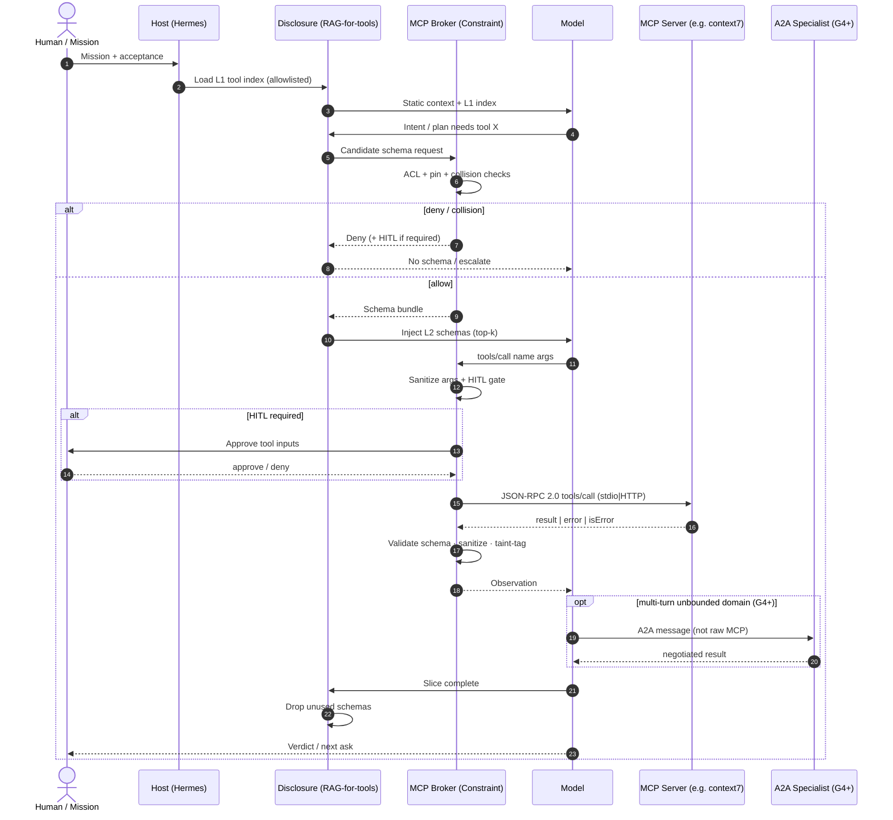

# TOOL_CALL_SEQUENCE.md
## G2 — Tool call sequence (broker + optional A2A)

**Status:** LOCKED declarative · `OPTION_2_STANDARD`  
**Resume:** `G2_TOOL_REGISTRY_LOCKED_v1`

### Notes
- A2A path remains **schema-only** until `G4_TOPOLOGY_APPROVED_v1`.
- Payment / A2UI extensions stay disabled under OPTION_2.
- LRO (>10s): broker emits warning and requests HITL continue or async task (see `timeout_budgets.yaml`).
