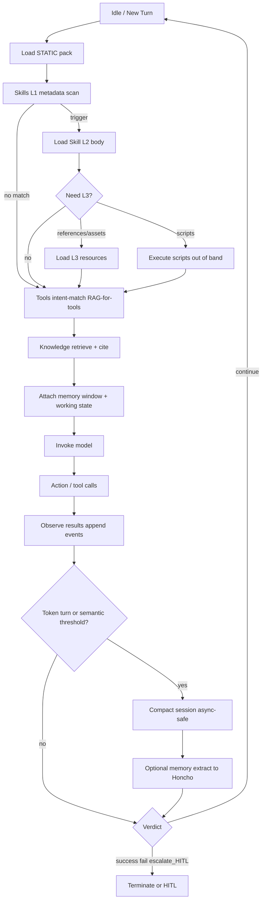

# SESSION_STATE_SPEC.md

**Domain:** G3 — Memory & Stateful Agents  
**Status:** LOCKED · declarative only  
**Resume token (BLUE authoritative):** `G3_CONTEXT_LAYER_LOCKED_v1` (LOCKED)  
**Parents:** `CONTEXT_ENGINEERING_BLUEPRINT.md` · `HARNESS_SPEC.md` §2 · WP-F3 · WP-S3  
**Companion:** `HONCHO_INTEGRATION_MATRIX.yaml`

---

## 1. Purpose

Formalize how this workspace assembles context per turn, manages session lifecycle, applies compaction, and interfaces to durable memory (Honcho) **without** embedding executable agent runtime code.

Binding goals:

1. Preserve HARNESS context assembly order.  
2. Keep short-term working memory bounded (sliding budgets + compaction).  
3. Route long-term personalization through Honcho with redaction and ceilings.  
4. Align skills progressive disclosure (L1→L2→L3) with session cost envelopes.

---

## 2. Glossary

| Term | Normative meaning |
|---|---|
| **Session** | Single continuous conversation owned by one principal; holds events + working state |
| **Event** | Ordered record: `user_message` \| `assistant_message` \| `tool_call` \| `tool_result` \| `system_notice` |
| **Working state** | Structured scratchpad for the live mission (`session:*` keys) |
| **Memory item** | Extracted, framework-agnostic fact/summary/card fragment persisted across sessions |
| **Static pack** | Always-on Instructions ∩ core Guardrails ∩ pinned Memory |
| **L1 / L2 / L3** | Skill metadata / body / resources (agentskills.io) |
| **Compaction bookmark** | Marker of which event IDs are covered by an existing summary so raw events are not double-sent |
| **Verdict** | End-of-cycle label: `continue` \| `success` \| `fail` \| `escalate_HITL` |

---

## 3. Context assembly sequence (normative)

Every model invocation **must** assemble in this order (HARNESS_SPEC §2.3 + G2 tool disclosure):

```
1. STATIC PACK
   a. Distilled Instructions (AGENTS.md / constitution slice)
   b. Core Guardrails (constraint IDs always-on)
   c. Pinned Memory (peer card / standing profile only)

2. SKILLS
   a. L1 metadata scan (routing catalog or active capability profile subset)
   b. Trigger match → load L2 SKILL.md body
   c. L3 references/assets/scripts strictly as body demands
      (scripts preferably execute out-of-band; do not paste full script source)

3. TOOLS (RAG-for-tools)
   a. Intent-match against G2 registry / allowlist (T1+T2 under OPTION_2)
   b. Inject only eligible tool schemas
   c. Drop schemas after use when budget pressure high

4. KNOWLEDGE
   a. Path-scoped or MCP/RAG retrieve with citations
   b. Chunk; never dump whole whitepapers into thr turned context

5. MEMORY WINDOW
   a. Hybrid recall snippets (Honcho search / context snapshot)
   b. Recent session events inside sliding budget
   c. Working-state projection (mission, open files, todos)

6. USER TURN + RESERVE
   a. Current user message
   b. Completion / structured-verdict headroom
```

### 3.1 Mermaid — progressive disclosure & session life-cycle



---

## 4. Namespaces & ToolContext surface

Logical keyspace for working state and memory pins (BLUE):

| Namespace | Lifetime | Who writes | Examples |
|---|---|---|---|
| `user:` | Cross-session | Memory provider + curated conclusions | `user:preferences.tone`, `user:env.wsl_mandate` |
| `session:` | Single session | Agent runtime / harness | `session:mission`, `session:open_files`, `session:compaction.bookmark` |
| `app:` | Workspace/product | Humans + gated config | `app:mode.option_2`, `app:harness.g3_status` |

### 4.1 ToolContext API (declarative interface — not an implementation)

Pseudo-signature for the session/memory backend boundary:

```
ToolContext
  session_id: string
  principal_id: string
  workspace_id: string

  # Working state
  get_state(ns_key: "user:|session:|app:*") -> value | null
  set_state(ns_key, value, *, ttl_sec?: int) -> void
  delete_state(ns_key) -> void

  # Events
  append_event(event: Event) -> event_id
  list_events(*, after_id?, limit?, roles?) -> Event[]
  get_compaction_bookmark() -> { covered_through_event_id, summary_ref? }

  # Assembly helpers
  build_static_pack() -> ContextSlice
  match_skills(turn: TurnInput) -> SkillHit[]
  disclose_tools(intent: Intent) -> ToolSchema[]
  window_memory(budget_tokens: int) -> MemorySlice

  # Lifecycle hooks (see §7)
  on_session_start()
  on_turn_begin()
  on_turn_end(observation)
  on_compact(trigger)
  on_session_close(reason)
```

No executable logic is deposited by this G3 pre-gate pack.

---

## 5. Sliding token budgets

Values are **shares of the active model context window** unless noted. Absolute token numbers must be derived at runtime from the live model window (dynamic routing — no frozen model pins in constitution).

### 5.1 Envelope (from HARNESS_SPEC §2.2)

| Bucket | Share | Contents |
|---|---|---|
| Instructions | 5–10% | Distilled constitution |
| Guardrails core | 3–5% | Inviolable constraint text |
| Pinned memory | 2–5% | Peer card / standing profile |
| Mission + scene | 15–25% | Goal, acceptance criteria, file map |
| Dynamic | 40–60% | L2 skills, tools, knowledge, examples, live observations |
| Reserve / output | 10–15% | Completion + verdict structure |

**Hard rule:** static payload (Instructions + Guardrails + pinned memory) **≤ 20%** of window; else force progressive disclosure / capability profile subsetting before adding always-on text.

### 5.2 Session history band (inside Dynamic + Mission)

| Band | Guidance |
|---|---|
| Recent verbatim events | Prefer last **N ≤ 20** turns **or** backward-fill until **~15–25%** of window — whichever freer |
| Summary prefix | ≤ **8%** of window; referenced by compaction bookmark |
| Tool results retained | Keep only latest relevant; evict payloads folded into `session:` state |
| Skill L1 catalog | Target **~50 tok/skill**; use capability profiles if full tree would blow routing slice |
| Concurrent L2 bodies | Soft ≤ **3**; flag if estimated co-loaded L2 text > **~8k tok** |

### 5.3 Token-decay / quality curve (operational model)

Not a fitted equation — a **policy curve** used to justify compaction:

| Context fill (approx.) | Expected behavior | Required action |
|---|---|---|
| 0–40% | High attention fidelity | None |
| 40–70% | Rising latency/$ ; early rot risk mid-context | Evict stale tool blobs; prefer end/start placement of critical facts |
| 70–85% | Clear quality decay on long deps | **Count-based compaction** mandatory before next heavy tool loop |
| >85% or hard window-near | Overflow / severe rot | **Emergency truncate** to bookmark + pinned + last K turns; may `escalate_HITL` if mission-critical detail would be lost |

WP-S3 grounding: context rot appears **before** hard limits; Lost-in-the-Middle ⇒ keep critical pins at edges (static pack head + recent tail), not buried mid tool spam.

### 5.4 Waterfall (debit order when over budget)

When projected tokens exceed Dynamic + History allowances, debit in order:

1. Duplicate tool schemas  
2. Oldest tool_result payloads already reflected in state  
3. Low-score knowledge chunks  
4. Extra L3 reference prose  
5. Oldest verbatim turns (replace with summary)  
6. Extra co-loaded L2 skills (keep highest trigger score only)  
7. **Never** debit core Guardrails or sandbox isolation rules  
8. If still over → shrink mission scene notes + HITL if acceptance criteria would be lost  

---

## 6. Compaction policies

### 6.1 Strategy ladder

| ID | Strategy | Mutates stored events? | When |
|---|---|---|---|
| `C_SLIDE_N` | Keep last N turns in model view | No (view filter) | Default continuous |
| `C_TOKEN_BACKFILL` | Backward include until token cap | No | Every turn prepare |
| `C_TOOL_EVICT` | Drop stale tool_result bodies | Optional soft-delete artifacts | After state fold-in |
| `C_SUMMARY_RECURSIVE` | LLM summary of older span | No raw delete; add summary event + bookmark | Threshold / idle |
| `C_MEMORY_OFFLOAD` | Extract durable facts → Honcho | Session may shrink pins | On compact or session close |

Expensive strategies (`C_SUMMARY_RECURSIVE`, heavy extract) run **async when possible**, results **persisted**, and a **compaction bookmark** records `covered_through_event_id` so prepared context uses `summary ⊕ events_after_bookmark`.

### 6.2 Triggers

| Trigger | Default threshold (OPTION_2) | Action |
|---|---|---|
| Token pressure | Projected history+dynamic > band OR total fill > 70% | `C_TOOL_EVICT` → `C_TOKEN_BACKFILL` → schedule summary |
| Turn count | Every **20** turns short summary; every **60** long summary (aligned to Honcho summary defaults) | `C_SUMMARY_RECURSIVE` |
| Idle TTL | Session idle per retention policy | Compact + optional close |
| Semantic boundary | User signals new topic / mission success | Bookmark + optional memory offload |
| Emergency | >85% fill or provider context error | Truncate to safety pack + last K; log telemetry |

### 6.3 Retention of raw session vs view

- **Session store** retains append-only events until TTL/archive (integrity).  
- **Model view** is a pure function of store + bookmark + budgets.  
- Compaction of the view **must not** silently destroy audit history pre-TTL.

---

## 7. Session lifecycle hooks

| Hook | Moment | Obligations |
|---|---|---|
| `on_session_start` | New session ID minted | Bind principal ACL; init `session:` state; load pinned `user:` card; select capability profile |
| `on_turn_begin` | Before assembly | Refresh hybrid memory snapshot; recompute budgets from live window; L1 skill scan |
| `on_pre_model` | After assembly, before call | Enforce static ≤20%; redact secrets; strip disallowed tool schemas |
| `on_post_model` | After assistant message | Append events; update working state |
| `on_tool_result` | After each tool | Append tool_result;fold concise digest into `session:` when large |
| `on_turn_end` | Turn complete | Threshold check; schedule compact/extract; emit trajectory fields for G5 |
| `on_compact` | Compaction fires | Write summary + bookmark; never drop uncovered safety-critical pins |
| `on_memory_write` | Before Honcho conclude/card write | Redaction filter; namespace check; rate/token ceiling |
| `on_session_close` | Explicit close / TTL / user end | Final extract; mark closed; release locks |
| `on_hitl_pause` | Gate or escalation | Freeze mutations except telemetry; persist resume cursor |

### 7.1 State machine

```
NEW → ACTIVE ⇄ COMPACTING → ACTIVE → CLOSING → CLOSED
                ↘ HITL_PAUSED ↗
                     ↘ FAILED
```

---

## 8. Persistence backend interface

Two logical backends:

| Backend | Stores | Production mapping (this host) |
|---|---|---|
| **Session store** | Events, working state, bookmarks | Hermes local session DB + runtime (framework-owned) |
| **Memory manager** | Cards, conclusions, representations, hybrid search | **Honcho** loopback API (see matrix) |

### 8.1 Memory manager capabilities required

- Peer card read/write (standing facts)  
- Conclusion create/list/delete (PII deletion path)  
- Hybrid search over messages  
- Session-scoped message ingest for derivation  
- Async derivation / summary queue health  
- Dialectic/reasoning optional (on-demand tools only)

### 8.2 Security invariants

1. Session ownership ACL on every read/write.  
2. Redact secrets/PII **before** persist (`C-ARCH-03`, Honcho filters).  
3. No cross-profile skill/memory writes without explicit user direction.  
4. Honcho remains loopback-bound for API in OPTION_2; non-loopback bridges are G8 residual.  
5. Memory never overrides Constraint catalog.

---

## 9. Skills tree layout expectations

Workspace target (post-gate seed allowed):

```
skills/
  <category>/
    <skill-name>/
      SKILL.md          # L1 frontmatter + L2 body
      references/       # L3
      scripts/          # L3
      assets|templates/ # L3
```

**L1 lint targets:** YAML frontmatter present; `name` + `description` with what/when/when-not; description budget ~50 tokens (hedge ≤80).

**Today (Step B):** workspace `skills/` empty; progressive disclosure live in profile `wsl-runtime/skills` (93 SKILL.md). G3 gate does not require moving them pre-token.

---

## 10. Telemetry fields (minimum for G5 inheritance)

Each turn should be able to expose:

| Field | Meaning |
|---|---|
| `ctx.static_tokens_est` | Static pack estimate |
| `ctx.dynamic_tokens_est` | Dynamic slice estimate |
| `ctx.fill_ratio` | total/window |
| `skills.l1_count` | Metadata entries visible |
| `skills.l2_loaded` | Names of bodies loaded |
| `tools.schemas_loaded` | Count |
| `memory.pinned_tokens_est` | Card/profile |
| `memory.recall_hits` | Hybrid snippets count |
| `compact.trigger` | null or trigger id |
| `compact.bookmark_event_id` | Coverage cursor |
| `verdict` | continue/success/fail/escalate_HITL |

---

## 11. Compliance checklist (locked pack)

- [x] Assembly order fixed: static → skills → tools → knowledge → memory window  
- [x] Sliding budgets + debit waterfall defined (`token_budget.yaml`)  
- [x] Compaction strategies + triggers + bookmarks  
- [x] Lifecycle hooks listed  
- [x] Namespaces `user:` / `session:` / `app:`  
- [x] Mermaid life-cycle diagram  
- [x] Structural unit tests / co-load harness (`tests/test_g3_memory.py`)  
- [x] `token_budget.yaml`  
- [x] Workspace skills seed trees (5)  
- [x] Pack verifier `scripts/verify_g3_memory.py`  
- [x] `G3_CONTEXT_LAYER_LOCKED_v1` active spec lock

---

## 12. Non-actions

- Do not enable L4 / auto skill mutation (G7 domain only).  
- Do not treat G2 approval as G3 unlock.  
- Do not bind broker runtime in this spec (`DECLARED_NOT_WIRED` remains).  
- Do not claim CI coverage from declarative prose.

*End of SESSION_STATE_SPEC.md*
