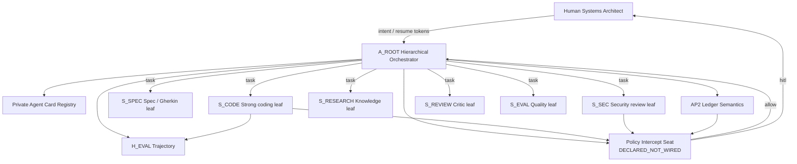

# MULTI_AGENT_TOPOLOGY.md

**Domain:** G4 — Multi-Agent Orchestration  
**Status:** DRAFT_PRE_GATE (Steps A–D emitted · HARD_STOP pending)  
**Operating overlay:** `OPTION_2_STANDARD` (binding until HITL)  
**Authoritative resume token (BLUE):** `G4_TOPOLOGY_APPROVED_v1`  
**Precedence:** Course-2 (WP-S2 / WP-S4 / WP-S1) supersedes Course-1 (WP-F1 / WP-F2 / WP-F4) on overlap  
**Upstream locked:** G1 `HARNESS_SPEC.md` · G2 `TOOL_REGISTRY.md` · G3 `CONTEXT_ENGINEERING_BLUEPRINT.md` · `G4_MIGRATION_CONTEXT.md`  
**Constraint:** Declarative artifacts only. No application runtime / imperative agent code in this pack.

---

## 0. Sources ingested

| Paper / artifact | Path | Role for G4 |
|---|---|---|
| BLUE §G4 | `specs/references/AGENTIC R&D & IMPLEMENTATION BLUE.md` L264–314 | Bound products, options, `RESUME_TOKEN` |
| WP-F1 | `WP-F1-Introduction to Agents.pdf` | L3 collaborative MAS, Coordinator / Sequential / Iterative Refinement / HITL patterns |
| WP-F2 | MCP interoperability | Agent-as-tool primitive; broker / confused-deputy caution |
| WP-F4 | Agent Quality | Trajectory / multi-agent dynamics, glass-box eval obligations (feeds G5) |
| WP-S1 | New SDLC / Factory | Conductor vs Orchestrator human modes; factory model |
| WP-S2 | Agent Tools & Interop (Course-2) | **Superseding** A2A, Agent Card, registries, A2UI/AP2/UCP/x402 extensions |
| WP-S4 | Security & Evaluation (Course-2) | Centralised Agent Gateway, agentic identity, circuit breakers, trust decay |
| Live Hermes (telemetry) | `wsl-runtime` profile | `delegate_task` defaults: `max_concurrent_children=3`, `max_spawn_depth=1` (nesting off) |

Extract landings (ephemeral): `/tmp/g4_extract/{F1,F2,F4,S1,S2,S4}_*`, `BLUE_G4.md`.

---

## 1. Problem statement

Single-agent “super-agents” collapse under tool-schema bloat, attention dilution, and unbounded domain negotiation (WP-S2). Level-3 systems require a **team of specialists** coordinated by an orchestration layer (WP-F1), with:

1. **Discovery** — how a root finds specialists and knows capabilities (Agent Cards + registries).  
2. **Communication** — task-oriented async protocol distinct from fire-and-forget tools (A2A vs MCP).  
3. **Accountability** — policy interception + cryptographically bound spend authority (AP2 mandates / x402).  
4. **Re-assembly** — deterministic aggregation + optional A2UI surfaces for HITL.  
5. **Failure containment** — timeouts, regional collisions, budget ceilings, circuit breakers (WP-S4 / BLUE Step E).

MCP stays the **bounded tool bus**. A2A is the **collaborative partner bus** so agent multi-turn negotiation does not inject GOTO-style control into tool graphs (WP-S2 “GOTO problem”).

---

## 2. Course crosswalk (Course-2 wins)

| Topic | Course-1 anchor | Course-2 supersession | G4 binding |
|---|---|---|---|
| MAS shape | WP-F1 L3 PM → specialists | WP-S2 monolithic *logical* partition → distributed A2A | Hierarchical root + AgentTool / A2A leaves |
| Discovery | WP-F1 Agent Card JSON “business card” | WP-S2 Card = CV (capabilities, security, interaction schemas) + public/private registries | Schema-first cards under `agent_cards/`; private registry default for OPTION_2 |
| Tool vs agent | WP-F2 Agent Tools | WP-S2 tools passive / agents collaborative; A2A isolates multi-turn | Leaves may present as AgentTools *only* when bounded & schema-closed; unbounded → A2A task |
| Commerce | WP-F1 AP2 + x402 sketch | WP-S2 AP2 mandates + UCP catalogs + x402 HTTP 402 extension | AP2 **ledger semantics declared**; live spend **policy-gated** |
| Security | WP-F1 hybrid guardrails + policy engine | WP-S4 Centralised Agent Gateway, agentic IDs, JIT downscope, circuit breakers | `POLICY_INTERCEPT_SPEC.yaml` seat; gateway **DECLARED_NOT_WIRED** until post-gate wiring |
| Quality | WP-F4 multi-agent trajectories | WP-S4 vibe trajectory + trust score + checkpoints | Failure-mode matrix + G5 handoff fields |
| Human role | WP-F1 HITL pattern | WP-S1 Conductor / Orchestrator | Root default L2 conductor path; L3 after this gate |

---

## 3. Pattern catalog (BLUE normalized)

| ID | Pattern | Control topology | When to use | OPTION_2 posture |
|---|---|---|---|---|
| P-SEQ | **Sequential** (assembly line) | Linear edges; output→input | Spec→impl→review linear factories | Allowed |
| P-PAR | **Parallel** fan-out / fan-in | Join barrier | Independent research / multi-file review | Allowed (cap concurrent) |
| P-HIER | **Hierarchical coordinator** | Root planner + specialist leaves | Default enterprise workflow | **PRIMARY** |
| P-IR | **Iterative refinement** | Generator ↔ critic loop | Quality gates on drafts | Allowed inside leaf or post-join |
| P-HITL | **Human-in-the-loop pause** | Edge kind `hitl` | Irreversible, payment, topology change | Required at gates |
| P-BB | **Blackboard** | Shared mutable workspace | Heavy multi-writer research | Deferred; needs G3 session ACL + G8 |
| P-SWARM | **Swarm** | Peer mesh, weak center | Creative exploration | **OPTION_3 only** |
| P-MONO | **Monolithic multi-agent** | In-process sub-agents, shared memory | Low-latency local teams | Allowed as *implementation* of leaves; still cards |
| P-DIST | **Distributed A2A** | Network boundary + task protocol | Vendor specialists / AaaS | Schema-ready; live remote default **off** |

**Primary topology (BLUE Step C recommended):** `hierarchical_coordinator_specialists` = P-HIER composed with P-PAR among free leaves + P-SEQ within linear factory steps + P-HITL on high-risk edges.

---

## 4. Hierarchical root orchestrator

### 4.1 Identity

| Field | Value |
|---|---|
| Node id | `A_ROOT` (aligns `specs/workflow_graph.yaml`) |
| Level | L2 default · L3 enabled only after `G4_TOPOLOGY_APPROVED_v1` |
| Persona | Factory floor **execution orchestrator**; strategic architecture remains HITL |
| Context assembly | G3 order: static → skills → tools → knowledge → memory window |
| Tooling | G2 T1+T2 only; broker seat retained |
| Model routing | Dynamic matrix (Premium / Strong / Flash) — **no frozen model pins** |

### 4.2 Root responsibilities (normative)

1. **Intent intake** — malicious / out-of-policy reject via Constraint pre-hooks.  
2. **Gherkin decomposition** — mission → feature scenarios → specialist-assignable tasks (see templates).  
3. **Capability match** — RAG over Agent Card L1 + registry allowlist (not free web hire).  
4. **Edge selection** — map each sub-task to `deterministic` \| `dynamic` \| `hitl` (Step C matrix).  
5. **Delegation** — emit task envelope; never bypass policy intercept.  
6. **Observation merge** — typed join; reject unschema'd free text as sole success signal.  
7. **Trajectory emit** — Mission→Scene→Thought→Action→Observation→Verdict for Evaluation (G5).  
8. **Escalate** — flat fix curves, budget threats, identity ambiguity → HITL.

### 4.3 Forbidden to root (OPTION_2)

- L4 AgentCreator / runtime self-spawn of unregistered agents (G7).  
- Unrestricted public marketplace hire without registry seat + security fields.  
- Autonomous AP2 settlement above mandate without intercept ACK.  
- Re-enabling host path inheritance or cross-profile skill writes.  
- Treating specialist memories as Constraint overrides.

---

## 5. Specialist edge map

| Edge id | From → To | Kind | Protocol | Decision driver | Risk |
|---|---|---|---|---|---|
| E_R_INTAKE | HUMAN → A_ROOT | hitl / dynamic | session | Human intent | MED |
| E_R_PLAN | A_ROOT internal | dynamic | N/A | LLM plan + Gherkin | MED |
| E_R_MATCH | A_ROOT → Registry | deterministic | card query | Allowlist + tags | LOW |
| E_R_POLICY | A_ROOT → Policy seat | deterministic | intercept API (declared) | Rules engine | HIGH seat |
| E_R_LEAF | A_ROOT → S_* | dynamic | AgentTool **or** A2A task | Capability match | MED–HIGH |
| E_LEAF_MCP | S_* → MCP tools | deterministic post-broker | MCP | G2 broker | per-tool |
| E_LEAF_BACK | S_* → A_ROOT | deterministic schema | A2A task result / tool result | Contract validation | MED |
| E_JOIN | join barrier → A_ROOT | deterministic | N/A | All-success / quorum policy | MED |
| E_CRITIC | Generator → Critic | dynamic | internal/A2A | Rubric against Gherkin | MED |
| E_PAY | * → AP2 ledger | hitl or deterministic ceiling | AP2 / x402 | Mandate verify | **CRITICAL** |
| E_UI | A_ROOT → A2UI surface | dynamic optional | A2UI ext | Aggregate presentation | LOW (render) |
| E_ESC | any → HUMAN | hitl | session | Catalog triggers | — |
| E_EVAL | any → H_EVAL | deterministic | traces | Trajectory score | LOW |

Live Hermes mapping (substrate, not blueprint lock-in):

| Hermes construct | Topology role |
|---|---|
| Parent agent | `A_ROOT` |
| `delegate_task` leaf | In-process / local specialist (P-MONO style) |
| `delegation.max_concurrent_children` default **3** | Hard fan-out ceiling until reconfigured |
| `delegation.max_spawn_depth` default **1** | No nested orchestrators without HITL config change |
| Remote A2A | Not live; cards `lifecycle: schema_only` |

---

## 6. A2A discovery handshake — state machine

States are **declarative**. No runtime server is implied until post-gate wiring.

```
[*] → CARD_RESOLVE
CARD_RESOLVE → SECURITY_EVAL → (DENY_TERMINAL | QUOTE_CAPS)
QUOTE_CAPS → POLICY_CHECK → (DENY_TERMINAL | TASK_OFFER)
TASK_OFFER → (NEGOTIATE | ACCEPTED)
NEGOTIATE → (TASK_OFFER | DENY_TERMINAL | HITL_WAIT)
ACCEPTED → RUNNING
RUNNING → (RUNNING | NEEDS_INPUT | PAYMENT_HOLD | COMPLETED | FAILED | TIMED_OUT | CANCELLED)
NEEDS_INPUT → (RUNNING | HITL_WAIT | CANCELLED)
PAYMENT_HOLD → (AP2_MANDATE_CHECK → RUNNING | DENY_TERMINAL | HITL_WAIT)
HITL_WAIT → (RUNNING | CANCELLED | DENY_TERMINAL)
COMPLETED → AGGREGATE
FAILED | TIMED_OUT | CANCELLED | DENY_TERMINAL → AGGREGATE / ESCALATE
```

### 6.1 Transition table (normative)

| From | Event | Guard | To | Emitter |
|---|---|---|---|---|
| CARD_RESOLVE | `card.found` | schema valid + registry allow | SECURITY_EVAL | Root |
| CARD_RESOLVE | `card.missing` | — | DENY_TERMINAL | Root |
| SECURITY_EVAL | `sec.pass` | risk_tier ≤ budget; authN ok | QUOTE_CAPS | Policy seat |
| SECURITY_EVAL | `sec.fail` | spoof / tier breach / missing ID | DENY_TERMINAL | Policy seat |
| QUOTE_CAPS | `caps.bound` | timeout + token + $ ceilings set | POLICY_CHECK | Root |
| POLICY_CHECK | `policy.allow` | intercept allow | TASK_OFFER | Policy seat |
| POLICY_CHECK | `policy.deny` | — | DENY_TERMINAL | Policy seat |
| POLICY_CHECK | `policy.hitl` | high-stakes class | HITL_WAIT | Policy seat |
| TASK_OFFER | `task.accept` | card.interaction match | ACCEPTED | Leaf |
| TASK_OFFER | `task.counter` | within renegotiate budget | NEGOTIATE | Leaf |
| TASK_OFFER | `task.reject` | — | DENY_TERMINAL | Leaf |
| RUNNING | `task.progress` | heartbeat < timeout | RUNNING | Leaf |
| RUNNING | `task.need_input` | clarification schema | NEEDS_INPUT | Leaf |
| RUNNING | `payment.required` | x402/AP2 | PAYMENT_HOLD | Leaf/ext |
| RUNNING | `task.done` | result schema valid | COMPLETED | Leaf |
| RUNNING | `task.error` | retry budget left? | FAILED or RUNNING | Leaf |
| RUNNING | `timer.fire` | — | TIMED_OUT | Root watchdog |
| PAYMENT_HOLD | `mandate.ok` | signature + ceiling | RUNNING | AP2 seat |
| PAYMENT_HOLD | `mandate.fail` | — | DENY_TERMINAL | AP2 seat |
| * | `human.cancel` | — | CANCELLED | HITL |

### 6.2 Handshake guarantees

- **No silent tool wrapping of unbounded agents** (GOTO avoidance).  
- **Every RUNNING task** carries `task_id`, `parent_trace_id`, `card_id`, `caps`, `mandate_ref?`.  
- **Heartbeats** required for LRO > G2 `10000 ms` threshold; else async ticket + HITL visibility.  
- Nested multi-agent **session event translation** residual (G3 handoff) owned here: child events roll up as Observations, never raw ambient memory inject.

---

## 7. Agent Card model (summary)

Full mocks: `specs/g4_orchestration/agent_cards/*.json`.

**Normative fields (WP-S2 + agentskills-aligned risk):**

| Field | Purpose |
|---|---|
| `name` / `id` / `version` | Identity |
| `description` | L1 routing (~50 tok target prose) |
| `url` / `endpoint` | A2A endpoint or `local://` |
| `capabilities[]` | Skills / tasks advertised |
| `skills[]` | agentskills.io refs (name, level, risk_tier) |
| `security` | auth schemes, data classes, residency |
| `defaultInputModes` / `defaultOutputModes` | MIME / schema |
| `interaction` | streaming, multi-turn, sync/async |
| `risk_tier` | T0…T4 aligned G2 procurement spirit |
| `ap2` / `x402` | payment extension advertisements |
| `policy` | required intercept classes |
| `lifecycle` | `schema_only` \| `mock` \| `wired` |

---

## 8. AP2 micro-payment ledger semantics

### 8.1 Roles

| Role | Duty |
|---|---|
| **Mandate issuer (human / org)** | Signs spend rules before agent run |
| **Shopping / planner agent** | Builds intent via UCP-like catalogs (when enabled) |
| **Payer agent / wallet seat** | Presents mandate; never raw PAN in prompts |
| **Merchant / leaf agent** | Quotes; verifies mandate; settles |
| **Ledger** | Append-only audit of intents, holds, captures, voids |
| **Policy intercept** | Hard-blocks out-of-mandate |

### 8.2 Ledger entry (logical schema)

```yaml
ledger_entry:
  entry_id: ulid
  ts: iso8601
  task_id: string
  card_id: string
  mandate_id: string
  kind: intent|hold|capture|void|refund|reject
  amount:
    currency: ISO-4217
    minor_units: int
  caps_snapshot:
    max_per_tx: int
    max_per_task: int
    max_per_session: int
    merchant_allowlist: [string]
  evidence:
    intent_hash: hex
    mandate_sig_ref: string   # pointer, not raw key material
    policy_decision_id: string
  status: pending|posted|rejected
```

### 8.3 Rules (OPTION_2)

1. **No mandate → no settle** (fail closed).  
2. Capture amount **≤** hold **≤** mandate ceilings; merchant on allowlist.  
3. Any mutation of ceiling mid-flight requires **new mandate** + HITL.  
4. x402 `402 Payment Required` enters `PAYMENT_HOLD`; unpaid loops cannot burn tokens unbounded (circuit breaker).  
5. Ledger writings are Constraint-visible telemetry; **no secrets** in entries.  
6. Live AaaS marketplace billing remains disabled until G10 / explicit commerce gate.  
7. **UCP** sell-side catalogs: declared extension, `enabled_option_2: false` by default (discover-only mocks OK).

### 8.4 Relationship to G2

G2 left A2A/AP2/x402 `enabled_option_2: false`. G4 **schemas** the plane; wiring remains post-token + separate enable flags in `workflow_graph.yaml` / policy pack.

---

## 9. Gherkin decomposition (orchestration view)

Root does **not** free-form task salad. BLUE requires mission → Gherkin sub-specs:

```
Mission (user intent)
  → Feature (business capability)
    → Scenario (observable behaviour)
      → Task envelope (specialist assignment + schema + caps)
```

Templates: `GHERKIN_DECOMPOSITION_TEMPLATES.md`.  
Each Scenario carries `@agent:<card_id>` tags and `@risk:<tier>` for policy.

---

## 10. Policy server interception (seat)

Enterprise path (WP-S4 Centralised Agent Gateway + WP-F1 policy engine):

```
Root plan / leaf call
  → Policy Intercept (AuthZ, not AuthN alone)
    → allow | deny | hitl | rewrite_caps
  → Broker (G2 tools) / A2A executor / AP2 wallet
```

Full declarative seat: `POLICY_INTERCEPT_SPEC.yaml`.  
Status analog to G2 broker: **`DECLARED_NOT_WIRED`** is a valid permanent architectural seat through pre-gate.

---

## 11. A2UI result aggregation (optional plane)

- Leaves return **data schemas** first.  
- Root may project aggregates through A2UI catalog components for HITL review.  
- OPTION_2: A2UI **aggregation allowed as mock**; live generative UI off until explicit enable (G2 precedent).  
- Never treat UI ack as mandate signature.

---

## 12. Inheritance locks (must not casually reopen)

1. G3 assembly order unchanged.  
2. Tools T1+T2 under OPTION_2.  
3. Memory advisory only.  
4. L4 forbidden.  
5. Honcho AUTH + bridge exposure → G8 residual.  
6. Sandbox / `appendWindowsPath=false` inviolable.

---

## 13. Live substrate telemetry (observed, not constitutional pins)

| Knob | Observed default (wsl-runtime session tools) | Topology implication |
|---|---|---|
| `delegation.max_concurrent_children` | 3 | Parallel fan-out hard cap |
| `delegation.max_spawn_depth` | 1 (orchestrator forced to leaf) | True nested hierarchy needs config HITL |
| Leaf tools stripped | no nested `delegate_task` / `clarify` / `memory` / `send_message` | Matches AgentTool leaf purity |
| Background delegate durability | dies with parent session | Prefer durable cron/process for long A2A |

Constitution binds **caps as policy fields**, not Hermes version pins.

---

## 14. Mermaid — logical multi-agent plane



---

## 15. Definition of done for topology pack (pre-gate)

| Artifact | Role |
|---|---|
| `MULTI_AGENT_TOPOLOGY.md` | This deep-spec |
| `agent_cards/*.json` | Mock registry |
| `workflow_graph.yaml` (domain) | ADK-style graph |
| `GHERKIN_DECOMPOSITION_TEMPLATES.md` | BDD decomposition |
| `POLICY_INTERCEPT_SPEC.yaml` | Gateway seat |
| `FAILURE_MODE_MATRIX.yaml` | Timeouts / collisions / budget |

Post-gate (deferred unless token expands scope): Step E structural tests, Step F `orchestration-v1.0.0` tag, root `workflow_graph.yaml` node flip to APPROVED.

---

## 16. HITL contract (mirror BLUE)

**GIVEN** topology, cards, Gherkin templates, policy seat, failure-mode matrix  
**WHEN** human reviews options  
**THEN** HARD_STOP until `G4_TOPOLOGY_APPROVED_v1`

| Option | Summary |
|---|---|
| OPTION_1_CONSERVATIVE | Single orchestrator + few sequential specialists; **no** autonomous payments |
| OPTION_2_STANDARD ★ | Hierarchical LLM root + explicit AgentTool leaves + AP2 **with spending limits** + policy server |
| OPTION_3_CREATIVE | Full swarm + unrestricted A2A micro-economy + live A2UI aggregation |

**RECOMMENDED_PATH:** `OPTION_2_STANDARD`  
**RATIONALE:** Matches G-domain hierarchy; financial guardrails human-auditable; aligns G1/G2/G3 overlays without burning substrate.

---

*G4 Step A synthesis — declarative only — 2026-07-24*
